::: {.learning-outcomes}
## Resultados de aprendizaje

Al finalizar esta clase, el estudiante estará en capacidad de:

- Distinguir energía, calor y trabajo en el análisis termodinámico.
- Diferenciar sistemas cerrados y volúmenes de control.
- Reconocer propiedades, estados, procesos y formas de energía.
:::

## 1. Generalidades de la termodinámica

TERMODINÁMICA: Ciencia que estudia la energía en forma de calor para producir trabajo

MÁQUINA TÉRMICA: Es una máquina que aprovecha el calor para producir trabajo.

{fig-cap="Recurso visual de la presentación original · diapositiva 2"}

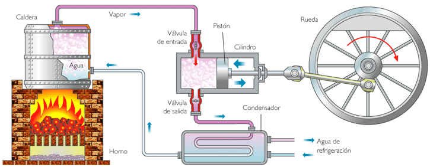{fig-cap="Recurso visual de la presentación original · diapositiva 2"}

## 2. Energía, calor y trabajo

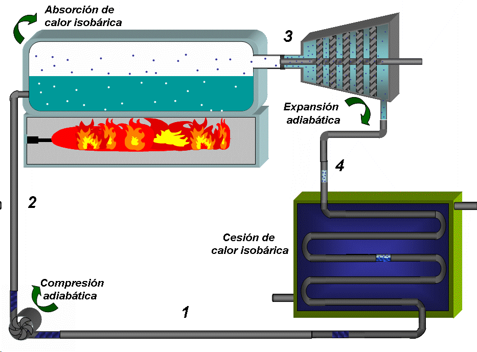{fig-cap="Recurso visual de la presentación original · diapositiva 3"}

## 3. Aplicación: transformación energética

Ejercicio:

Determinar el costo mensual que se debe pagar por el uso de un refrigerador doméstico que tiene una potencia nominal de 3/8 [HP]. Considere que el costo de energía en el Ecuador es de $0,10 cada kW-h. Además, considere que el compresor solo trabaja la tercera parte en una hora.

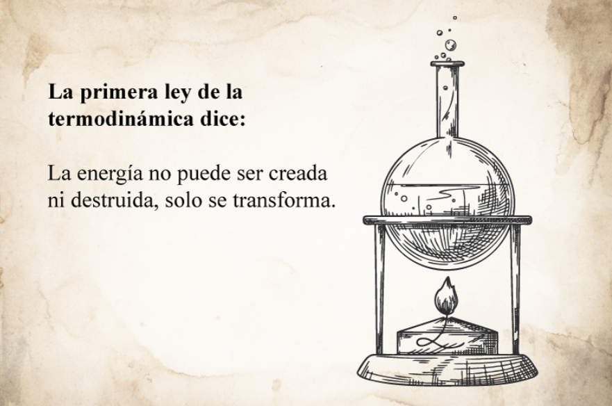{fig-cap="Recurso visual de la presentación original · diapositiva 4"}

## 4. Sistemas cerrados y abiertos

Sistema: Un sistema se define como una cantidad de materia o una región en el espacio elegida para análisis.

Un sistema cerrado (conocido también como una masa de control) consta de una cantidad fija de masa y ninguna otra puede cruzar su frontera.

Un sistema abierto, o un volumen de control, generalmente encierra un dispositivo que tiene que ver con flujo másico, como un compresor, turbina o tobera.

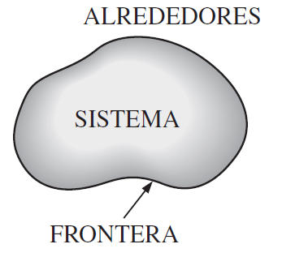{fig-cap="Recurso visual de la presentación original · diapositiva 5"}

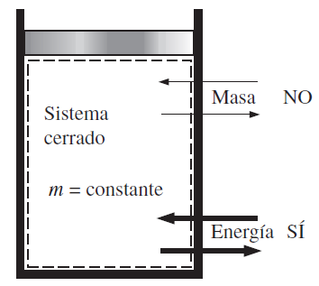{fig-cap="Recurso visual de la presentación original · diapositiva 5"}

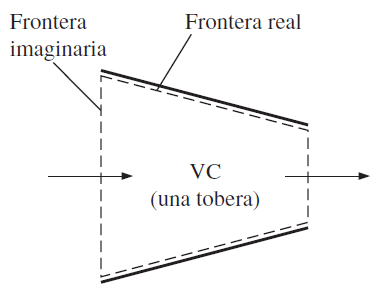{fig-cap="Recurso visual de la presentación original · diapositiva 5"}

## 5. Propiedades intensivas y extensivas

Cualquier característica de un sistema se llama propiedad.

Presión (P): fuerza por unidad de área → [Pa]; [psi]

Temperatura (T): propiedad que mide la energía interna → [ºC]; [ºF]

Volumen (V): espacio que ocupa un cuerpo → [m3]; [ft3]

Masa (m): cantidad de materia que tiene un cuerpo → [kg]; [lb-m]

Las propiedades intensivas son aquellas independientes de la masa de un sistema, como temperatura, presión y densidad. Las propiedades extensivas son aquellas cuyos valores dependen del tamaño o extensión del sistema.

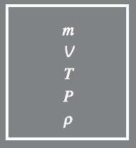{fig-cap="Recurso visual de la presentación original · diapositiva 6"}

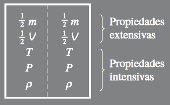{fig-cap="Recurso visual de la presentación original · diapositiva 6"}

## 6. Postulado de estado

Postulado de estado: el estado de un sistema compresible queda definido por 2 propiedades intensivas independientes, por ejemplo: T y v.

OJO: la presión y temperatura no son independientes en el cambio de fase.

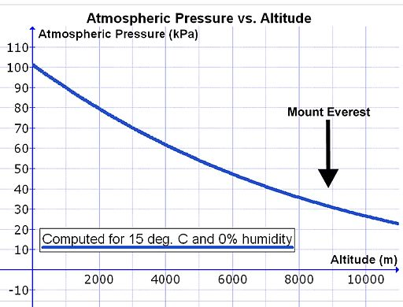{fig-cap="Recurso visual de la presentación original · diapositiva 8"}

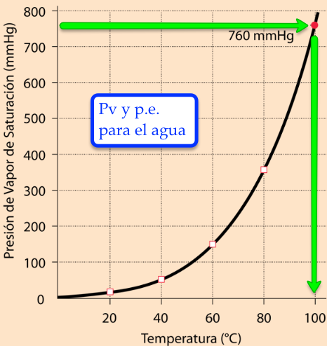{fig-cap="Recurso visual de la presentación original · diapositiva 8"}

## 7. Presión

La presión absoluta es la presión medida con respecto al vacío absoluto (cero absoluto). La mayoría de los instrumentos de medición están calibrados con base en la presión atmosférica, por lo que muestran la presión manométrica. Cuando la presión está por debajo de la atmosférica, se denomina presión de vacío.

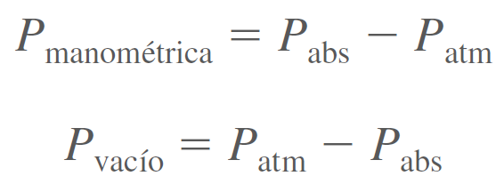{fig-cap="Recurso visual de la presentación original · diapositiva 9"}

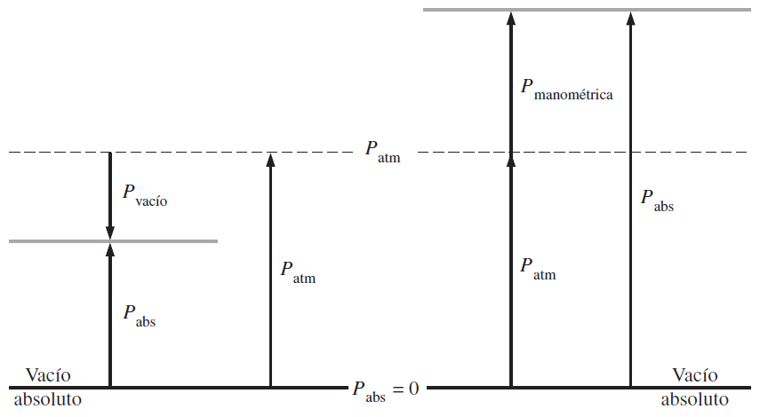{fig-cap="Recurso visual de la presentación original · diapositiva 9"}

## 8. Procesos y ciclos

Cualquier cambio de un estado de equilibrio a otro experimentado por un sistema es un proceso, y se dice que un sistema ha experimentado un ciclo si regresa a su estado inicial al final del proceso, es decir, para un ciclo los estados inicial y final son idénticos.

Proceso de compresión

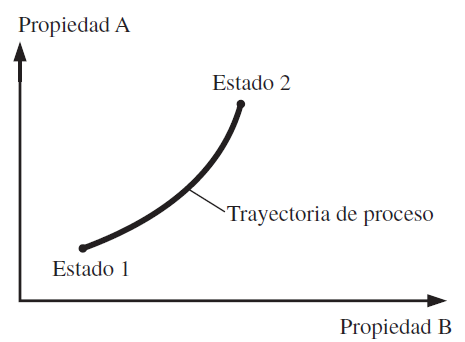{fig-cap="Recurso visual de la presentación original · diapositiva 10"}

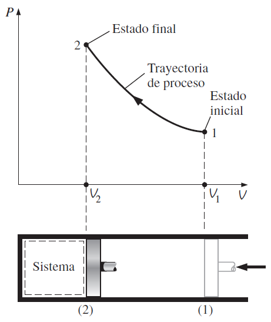{fig-cap="Recurso visual de la presentación original · diapositiva 10"}

## 9. Proceso de flujo estacionario

Estacionario significa que no hay cambio con el tiempo y su contrario es no estacionario o transitorio. Sin embargo, uniforme significa ningún cambio con la ubicación en una región específica.

Durante un proceso de flujo estacionario, las propiedades del fluido dentro del volumen de control podrían cambiar con la posición, pero no con el tiempo.

Es posible aproximarse a las condiciones de flujo estacionario mediante dispositivos diseñados para operar constantemente, como turbinas, bombas, calderas, condensadores, intercambiadores de calor, plantas de energía o sistemas de refrigeración.

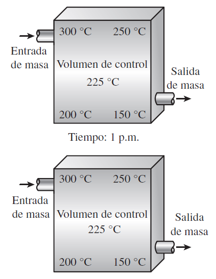{fig-cap="Recurso visual de la presentación original · diapositiva 11"}

## 10. Formas de energía

Las formas macroscópicas de energía son las que posee un sistema como un todo en relación con cierto marco de referencia exterior, como las energías cinética y potencial. Las formas microscópicas de energía son las que se relacionan con la estructura molecular de un sistema y el grado de la actividad molecular, y son independientes de los marcos de referencia externos.

La energía total de un sistema consta sólo de las energías cinética, potencial e interna, y se expresa como:

Energía total

Energía por unidad de masa

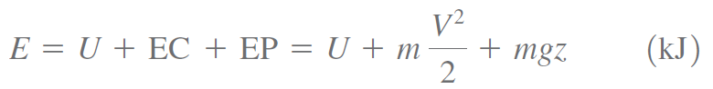{fig-cap="Recurso visual de la presentación original · diapositiva 12"}

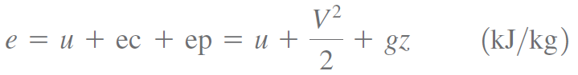{fig-cap="Recurso visual de la presentación original · diapositiva 12"}

::: {.key-ideas}
## Ideas clave

- Identifique siempre el **sistema**, los **datos conocidos** y las **propiedades requeridas** antes de plantear ecuaciones.
- Utilice unidades consistentes y represente los estados o procesos mediante el diagrama termodinámico apropiado cuando corresponda.
- Relacione cada ecuación con el comportamiento físico del equipo o proceso analizado.
:::
