::: {.learning-outcomes}
## Resultados de aprendizaje

Al finalizar esta clase, el estudiante estará en capacidad de:

- Reconocer las fases y regiones de una sustancia pura.
- Identificar estados saturados, sobrecalentados y comprimidos.
- Relacionar presión, temperatura y propiedades durante el cambio de fase.
:::

## 1. Sustancia pura

Una sustancia que tiene una composición química fija en cualquier parte se llama sustancia pura. El agua, el nitrógeno, el helio y el dióxido de carbono, por ejemplo, son sustancias puras.

Una mezcla de dos o más fases de una sustancia pura se sigue considerando una sustancia pura siempre que la composición química de las fases sea la misma.

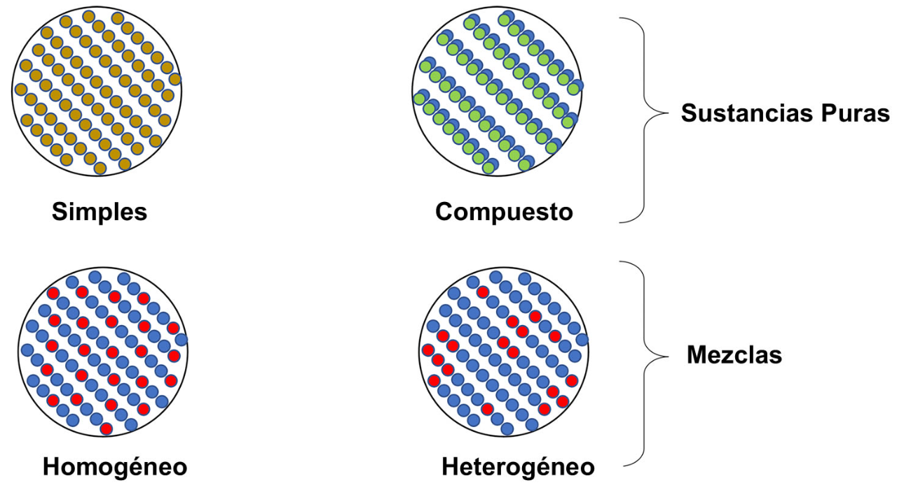{fig-cap="Recurso visual de la presentación original · diapositiva 2"}

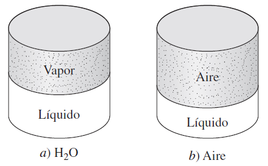{fig-cap="Recurso visual de la presentación original · diapositiva 2"}

## 2. Fases de una sustancia pura

Disposición de los átomos en diferentes fases: a) las moléculas están en posiciones relativamente fijas en un sólido, b) grupos de moléculas se apartan entre sí en la fase líquida y c) las moléculas se mueven al azar en la fase gaseosa.

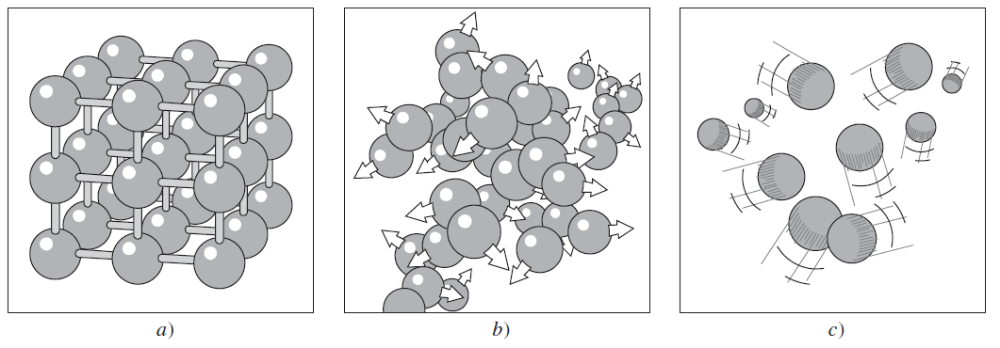{fig-cap="Recurso visual de la presentación original · diapositiva 3"}

## 3. Cambio de fases de una sustancia pura

Para el curso nos centraremos en el cambio de fase LÍQUIDO – VAPOR.

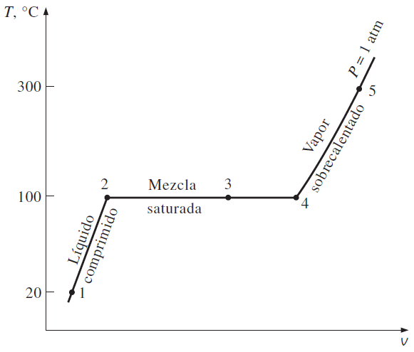{fig-cap="Recurso visual de la presentación original · diapositiva 4"}

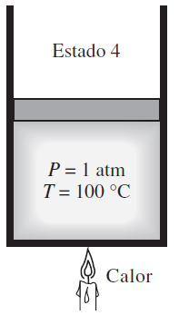{fig-cap="Recurso visual de la presentación original · diapositiva 4"}

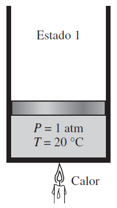{fig-cap="Recurso visual de la presentación original · diapositiva 4"}

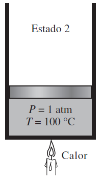{fig-cap="Recurso visual de la presentación original · diapositiva 4"}

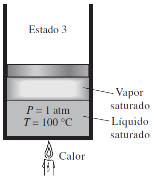{fig-cap="Recurso visual de la presentación original · diapositiva 4"}

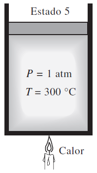{fig-cap="Recurso visual de la presentación original · diapositiva 4"}

## 4. Temperatura y Presión de saturación

A una determinada presión, la temperatura a la que una sustancia pura cambia de fase se llama temperatura de saturación, Tsat. Del mismo modo, a una temperatura determinada, la presión a la que una sustancia pura cambia de fase se llama presión de saturación, Psat.

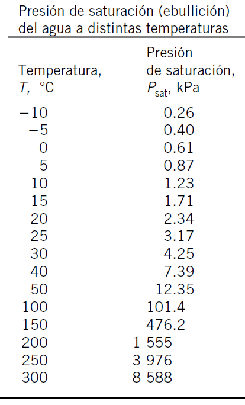{fig-cap="Recurso visual de la presentación original · diapositiva 5"}

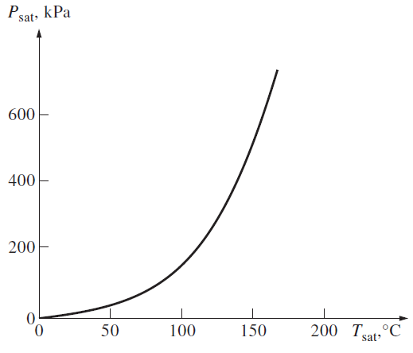{fig-cap="Recurso visual de la presentación original · diapositiva 5"}

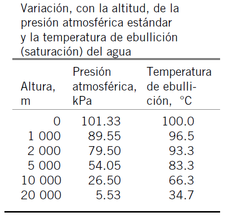{fig-cap="Recurso visual de la presentación original · diapositiva 5"}

## 5. Calor latente y sensible

El calor sensible causa un cambio de temperatura en una sustancia sin alterar su estado físico, mientras que el calor latente provoca un cambio de estado (fusión, solidificación, vaporización) sin afectar su temperatura.

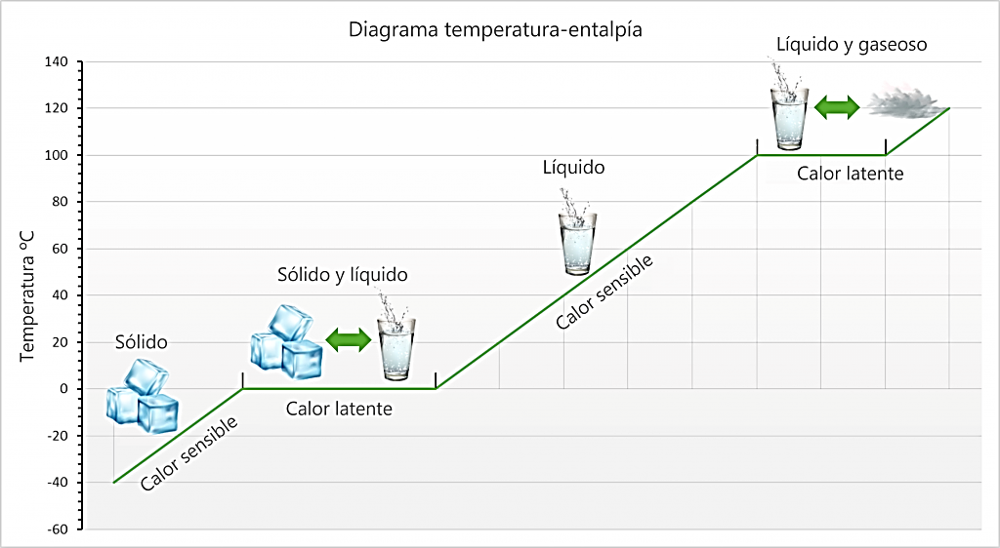{fig-cap="Recurso visual de la presentación original · diapositiva 6"}

## 6. Diagramas de propiedades termodinámicas

Nos ayudan a comprender los procesos de cambios de fases.

Punto crítico:

Es el punto en el que los estados de líquido saturado y de vapor saturado son idénticos.

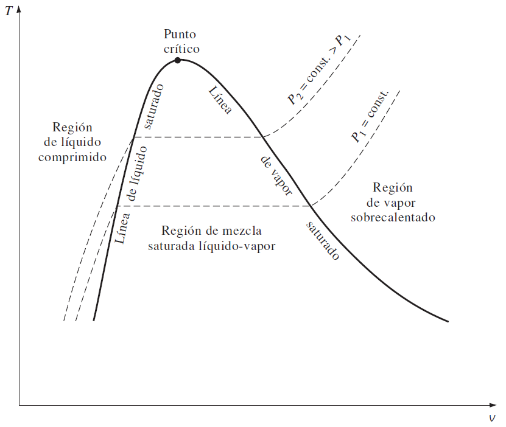{fig-cap="Recurso visual de la presentación original · diapositiva 7"}

## 7. Tablas de propiedades termodinámicas

Entalpía: energía de aprovechamiento en un sistema

Entropía: energía de desperdicio en un sistema

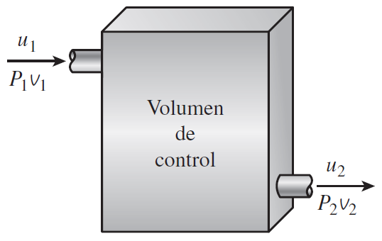{fig-cap="Recurso visual de la presentación original · diapositiva 8"}

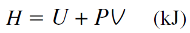{fig-cap="Recurso visual de la presentación original · diapositiva 8"}

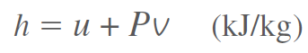{fig-cap="Recurso visual de la presentación original · diapositiva 8"}

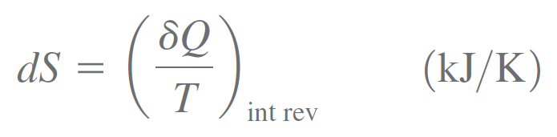{fig-cap="Recurso visual de la presentación original · diapositiva 8"}

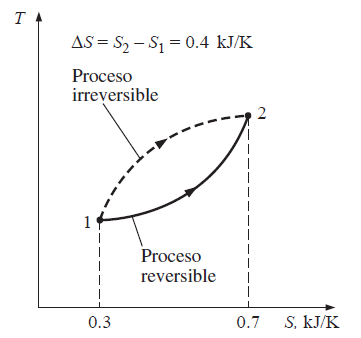{fig-cap="Recurso visual de la presentación original · diapositiva 8"}

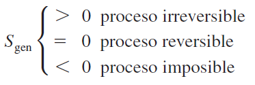{fig-cap="Recurso visual de la presentación original · diapositiva 8"}

## 8. Ejercicios propiedades termodinámicas

Un recipiente rígido contiene 50 kg de agua líquida saturada a 90 °C. Determine la presión en el recipiente y el volumen del mismo.

Un dispositivo que consta de cilindro-émbolo contiene 2 pies3 de vapor de agua saturada a 50 psia de presión. Determine la temperatura y la masa del vapor dentro del cilindro.

Una masa de 200 gramos de agua líquida saturada se evapora por completo en un dispositivo cilindro-émbolo a una presión constante de 100 kPa. Determine a) el cambio de volumen y b) la cantidad de energía transferida al agua.

Un recipiente rígido contiene 10 kg de agua a 90 °C. Si 8 kg del agua están en forma líquida y el resto como vapor, determine a) la presión en el recipiente y b) el volumen del recipiente.

Un recipiente de 80 L contiene 4 kg de refrigerante 134a a una presión de 160 kPa. Determine a) la temperatura, b) la calidad, c) la entalpía del refrigerante y d) el volumen que ocupa la fase de vapor.

## 9. Ejercicios propiedades termodinámicas

10 kg de R-143a llenan un dispositivo de pistón-cilindro de 0.7 m3 a una presión de 200 kPa. El recipiente se calienta hasta que la temperatura es de 30 °C. Determine la temperatura inicial y el volumen final del R-134a.

Determine la energía interna del agua a 20 psia y 400 °F.

Determine la temperatura del agua en un estado donde P = 0.5 MPa y h = 2.890 kJ/kg.

Determine la energía interna del agua a 80 °C y 5 MPa, con a) datos de la tabla para líquido comprimido y b) datos para líquido saturado. ¿Cuál es el error en el segundo caso?

## 10. Ejercicios propiedades termodinámicas

Complete esta tabla para el H2O:

Complete esta tabla para H2O:

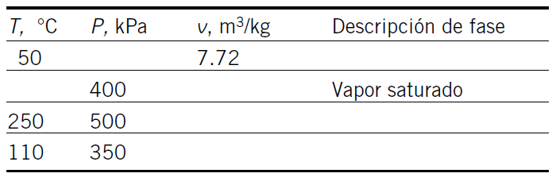{fig-cap="Recurso visual de la presentación original · diapositiva 11"}

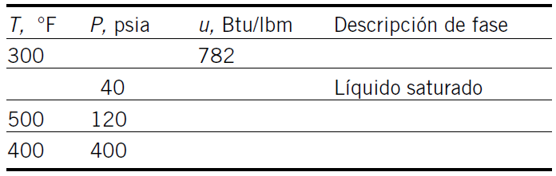{fig-cap="Recurso visual de la presentación original · diapositiva 11"}

## 11. Ejercicios propiedades termodinámicas

Complete esta tabla para el H2O:

Complete esta tabla para el R134A:

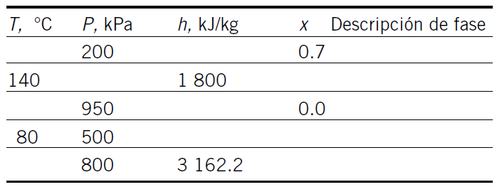{fig-cap="Recurso visual de la presentación original · diapositiva 12"}

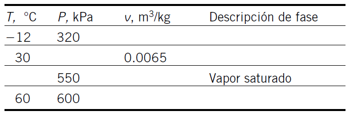{fig-cap="Recurso visual de la presentación original · diapositiva 12"}

## 12. Ejercicios propiedades termodinámicas

Complete esta tabla para el H2O:

Complete esta tabla para el R134A:

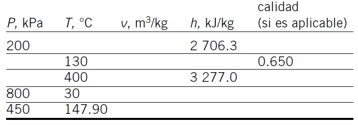{fig-cap="Recurso visual de la presentación original · diapositiva 13"}

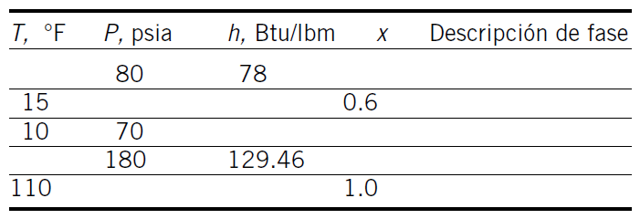{fig-cap="Recurso visual de la presentación original · diapositiva 13"}

::: {.key-ideas}
## Ideas clave

- Identifique siempre el **sistema**, los **datos conocidos** y las **propiedades requeridas** antes de plantear ecuaciones.
- Utilice unidades consistentes y represente los estados o procesos mediante el diagrama termodinámico apropiado cuando corresponda.
- Relacione cada ecuación con el comportamiento físico del equipo o proceso analizado.
:::
