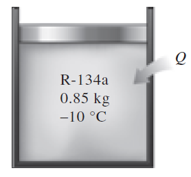
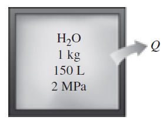
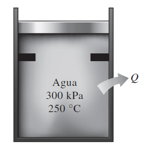

::: {.learning-outcomes}
## Resultados de aprendizaje

Al finalizar esta clase, el estudiante estará en capacidad de:

- Determinar el estado termodinámico a partir de propiedades conocidas.
- Seleccionar la tabla termodinámica adecuada.
- Calcular propiedades y cambios de energía en problemas aplicados.
:::

## 1. Ejercicios propiedades termodinámicas

Un dispositivo de cilindro-émbolo contiene 0.85 kg de refrigerante 134a, a -10 °C. El émbolo tiene movimiento libre, y su masa es 12 kg, con diámetro de 25 cm. La presión atmosférica local es 88 kPa. Se transfiere calor al refrigerante 134a hasta que su temperatura es 15 °C. Determine: a) la presión final, b) el cambio de volumen del cilindro y c) el cambio de entalpía en el refrigerante 134a.

Refrigerante 134a, cuyo volumen específico es 0.4618 pies3/lbm, fluye por un tubo a 120 psia. ¿Cuál es la temperatura en el tubo?

{fig-cap="Recurso visual de la presentación original · diapositiva 2"}

## 2. Ejercicios propiedades termodinámicas

Un kilogramo de agua llena un depósito de 150 L a una presión inicial de 2Mpa. Después se enfría el depósito a 40 °C. Determine la temperatura inicial y la presión final del agua.

Un contenedor rígido de 1.348 m3 se llena con 10 kg de refrigerante 134a a una temperatura inicial de –40 °C. Luego se calienta el contenedor hasta que la presión es de 200 kPa. Determine la temperatura final y la presión inicial. Respuesta: 66.3 °C, 51.25 kPa.

{fig-cap="Recurso visual de la presentación original · diapositiva 3"}

## 3. Ejercicios propiedades termodinámicas

100 kg de refrigerante 134a a 200 kPa están en un dispositivo de cilindro-émbolo, cuyo volumen es 12.322 m3. A continuación se mueve el émbolo, hasta que el volumen del recipiente es la mitad de su valor original. Esa compresión se hace de tal modo que la presión del refrigerante no cambia. Determine la temperatura final, y el cambio de energía interna total del refrigerante 134a.

6) Agua, inicialmente a 300 kPa y 250 °C, está contenida en un dispositivo cilindro-émbolo provisto de topes. Se deja enfriar el agua a presión constante hasta que adquiere la calidad de vapor saturado, y el cilindro está en reposo en los topes. Luego, el agua sigue enfriándose hasta que la presión es de 100 kPa. En el diagrama T-v , con respecto a las líneas de saturación, las curvas de proceso pasan tanto por los estados inicial e intermedio como por el estado final del agua. Etiquete los valores de T, P y v para los estados finales en las curvas del proceso. Encuentre el cambio total en energía interna entre los estados inicial y final por unidad de masa de agua.

{fig-cap="Recurso visual de la presentación original · diapositiva 4"}

## Recursos complementarios

- [Clase virtual 13 oct 2025.pdf](recursos/Clase%20virtual%2013%20oct%202025.pdf)

::: {.key-ideas}
## Ideas clave

- Identifique siempre el **sistema**, los **datos conocidos** y las **propiedades requeridas** antes de plantear ecuaciones.
- Utilice unidades consistentes y represente los estados o procesos mediante el diagrama termodinámico apropiado cuando corresponda.
- Relacione cada ecuación con el comportamiento físico del equipo o proceso analizado.
:::
