::: {.learning-outcomes}
## Resultados de aprendizaje

Al finalizar esta clase, el estudiante estará en capacidad de:

- Distinguir conducción, convección y radiación.
- Aplicar balances de energía en intercambiadores de calor.
- Analizar condensadores y evaporadores como dispositivos de flujo estacionario.
:::

## 1. Mecanismos de transferencia de calor

La transferencia de calor, o calor, puede ocurrir a través de tres mecanismos principales: conducción, convección y radiación.

Conducción:

Calentar una sartén sobre una cocina.

La transferencia de calor a través de una barra de metal.

Aislantes térmicos en casas.

Convección:

Sistema de calefacción de aire caliente.

El agua caliente que asciende en una olla.

El aire caliente que sale de una chimenea.

Radiación:

El calor del sol.

Calentadores solares.

Una estufa caliente.

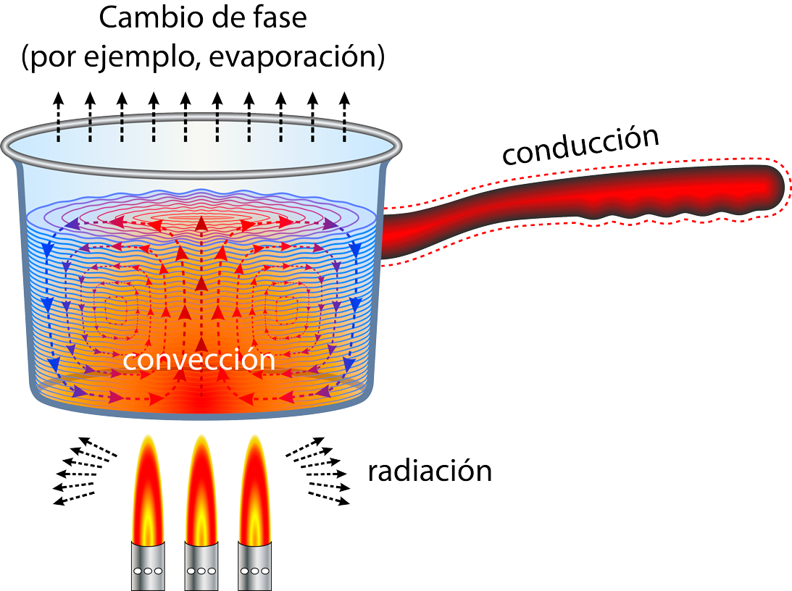{fig-cap="Recurso visual de la presentación original · diapositiva 2"}

## 2. Intercambiadores de calor

Los intercambiadores de calor son dispositivos donde dos corrientes de fluido en movimiento intercambian calor sin mezclado.

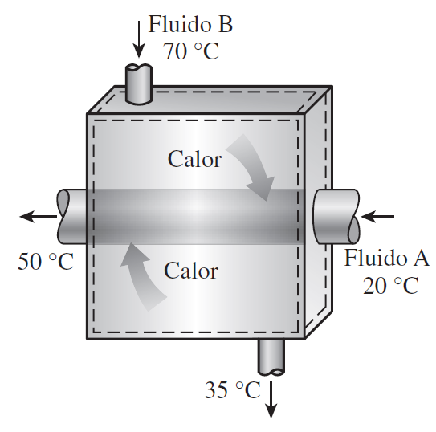{fig-cap="Recurso visual de la presentación original · diapositiva 3"}

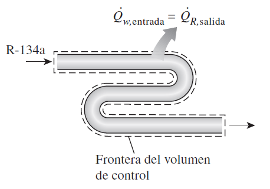{fig-cap="Recurso visual de la presentación original · diapositiva 3"}

## 3. Intercambiadores de calor

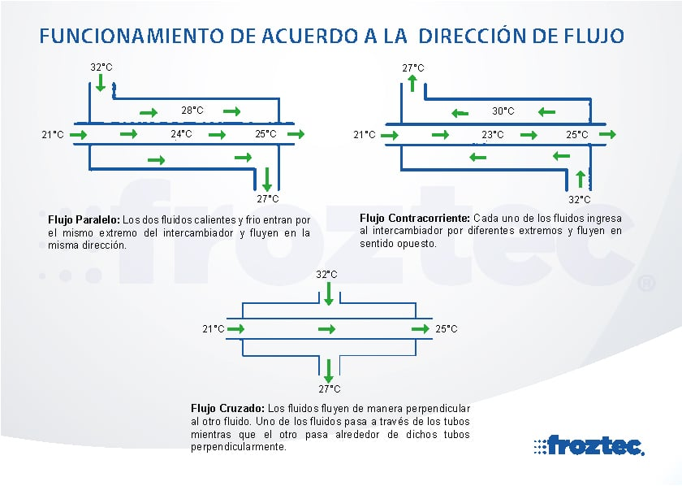{fig-cap="Recurso visual de la presentación original · diapositiva 4"}

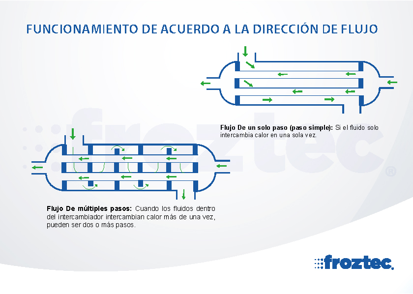{fig-cap="Recurso visual de la presentación original · diapositiva 4"}

## 4. Intercambiadores de calor

Ejercicio

Refrigerante 134a se va a enfriar con agua en un condensador. El refrigerante entra al dispositivo con un flujo másico de 6 kg/min a 1 MPa y 70 °C, y sale a

35 °C. El agua de enfriamiento entra a 300 kPa y 15 °C y sale a 25 °C.

Sin considerar las caídas de presión, determine:

a) el flujo másico de agua de enfriamiento requerido

b) la tasa de transferencia de calor desde el refrigerante hacia el agua.

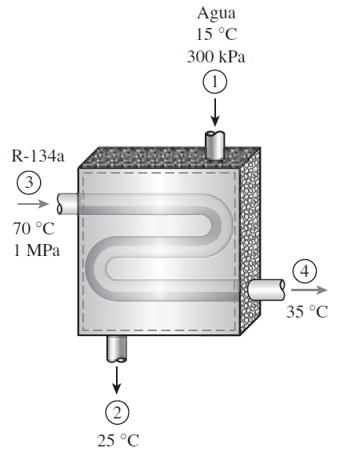{fig-cap="Recurso visual de la presentación original · diapositiva 5"}

## 5. Condensador de fluidos

Es un dispositivo que transfiere calor de un fluido (generalmente vapor) a otro (generalmente líquido) para que el vapor se condense en estado líquido.

Es un intercambiador de calor fundamental en sistemas de refrigeración, centrales eléctricas y otros procesos industriales.

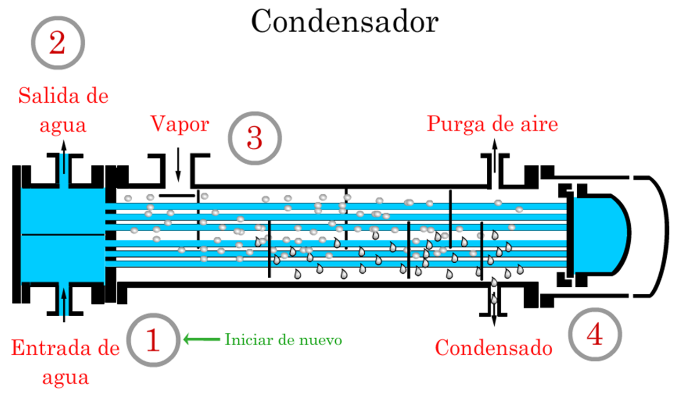{fig-cap="Recurso visual de la presentación original · diapositiva 6"}

## 6. Evaporador de fluidos

Un evaporador de fluidos es un dispositivo que convierte un líquido en vapor, absorbiendo calor del medio que lo rodea.

Este proceso se utiliza en diversas aplicaciones, desde la refrigeración hasta el tratamiento de aguas residuales.

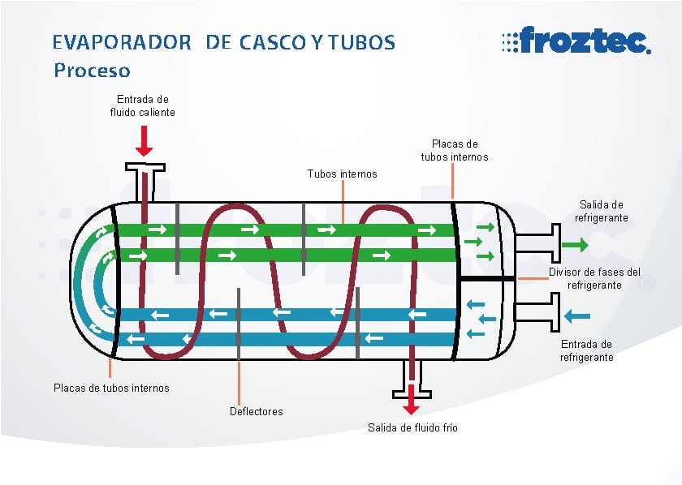{fig-cap="Recurso visual de la presentación original · diapositiva 7"}

## 7. Aplicación en un sistema de refrigeración

El evaporador se ubica en el ambiente a disminuir la temperatura, y el condensador en el ambiente de rechazo de calor.

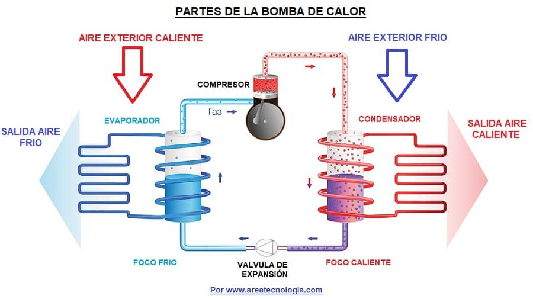{fig-cap="Recurso visual de la presentación original · diapositiva 8"}

## 8. Ejercicios de aplicación

1) A un condensador de una termoeléctrica entra vapor a 20 kPa y 95 por ciento de calidad, con un flujo másico de 20,000 kg/h. Se va a enfriar con agua de un río cercano, pasándola por los tubos ubicados en el interior del condensador.

Para evitar la contaminación térmica, el agua del río no debe tener un aumento de temperatura mayor de 10 °C. Si el vapor debe salir del condensador como líquido saturado a 20 kPa, determine el flujo másico del agua de enfriamiento requerido. Respuesta: 297.7 kg/s

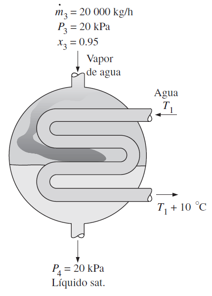{fig-cap="Recurso visual de la presentación original · diapositiva 9"}

## 9. Ejercicios de aplicación

2) En un intercambiador de calor se debe enfriar etilenglicol (cp = 2.56 kJ/kg·°C) que tiene un flujo de 3.2 kg/s, de 80 °C a 40 °C, usando agua (cp = 4.18 kJ/kg · °C), que entra a 20 °C y sale a 70 °C. Determine: a) la tasa de transferencia de calor, y b) el flujo másico de agua.

3) Un intercambiador de calor de tubos concéntricos con pared delgada, de contraflujo, se usa para enfriar aceite (cp = 2.20 kJ/kg·°C) de 150 a 40 °C, a una razón de 2 kg/s, usando agua (cp 4.18 kJ/kg · °C), que entra a 22 °C, a una razón de 1.5 kg/s. Determine la tasa de transferencia de calor en el intercambiador y la temperatura de salida del agua.

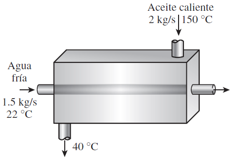{fig-cap="Recurso visual de la presentación original · diapositiva 10"}

## 10. Ejercicios de aplicación

4) Se diseña una unidad de intercambiador de calor con agua helada, para enfriar 5 m3/s de aire a 100 kPa y 30°C, hasta 100 kPa y 18°C, usando agua helada a 8 °C. Determine la temperatura máxima del agua a la salida, cuando su tasa de flujo es 2 kg/s. Respuesta: 16.3 °C

5) El condensador de un ciclo de refrigeración es básicamente un intercambiador de calor en el que se condensa un refrigerante mediante la transferencia de calor hacia un fluido a menor temperatura. Entra refrigerante 134a a un condensador a 1 200 kPa y 85 °C, con un flujo de 0.042 kg/s, y sale a la misma presión, subenfriado en 6.3 °C. La condensación se realiza mediante agua de enfriamiento, que experimenta una elevación de temperatura de 12 °C en el condensador. Determine:

a) la tasa de transferencia de calor al agua en el condensador, en kJ/min

b) el flujo másico del agua en kg/min. Respuestas: a) 525 kJ/min, b) 10.5 kg/min.

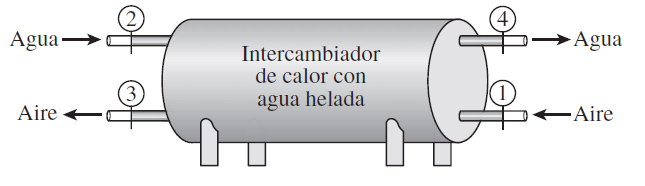{fig-cap="Recurso visual de la presentación original · diapositiva 11"}

## 11. Ejercicios de aplicación

7) El evaporador de un ciclo de refrigeración es básicamente un intercambiador de calor en el que se evapora un refrigerante mediante la absorción de calor de otro fluido. Entra refrigerante R-22 a un evaporador a 200 kPa, con una calidad de 22 por ciento y un flujo de 2.25 L/h. El R-22 sale del evaporador a la misma presión, sobrecalentado en 5 °C. El refrigerante se evapora absorbiendo calor del aire, cuyo flujo es 0.5 kg/s. Determine:

la tasa de calor absorbido del aire.

el cambio de temperatura del aire.

Las propiedades del R-22 a la entrada y a la salida del condensador son h1 = 220.2 kJ/kg, v1 = 0.0253 m3/kg, y h2 = 398.0 kJ/kg.

## 12. Ejercicios de aplicación

8) Un evaporador que utiliza R-134a trabaja a una presión constante de 100 kPa. El refrigerante entra al evaporador con una calidad de 0.25 y sale teóricamente como vapor saturado. El flujo másico del refrigerante es de 0.08 kg/s. Determine la temperatura de evaporación del R-134a y la tasa de calor que absorbe el refrigerante.

9) En un sistema de refrigeración con R-134a, el evaporador opera a una presión constante de 170 kPa. El refrigerante entra como mezcla saturada con una calidad del 30% y sale con un sobrecalentamiento de 10 °C. El flujo másico es de 0.06 kg/s. Determine la temperatura de evaporación del R-134a y la tasa de calor que absorbe el refrigerante.

::: {.key-ideas}
## Ideas clave

- Identifique siempre el **sistema**, los **datos conocidos** y las **propiedades requeridas** antes de plantear ecuaciones.
- Utilice unidades consistentes y represente los estados o procesos mediante el diagrama termodinámico apropiado cuando corresponda.
- Relacione cada ecuación con el comportamiento físico del equipo o proceso analizado.
:::
