::: {.learning-outcomes}
## Resultados de aprendizaje

Al finalizar esta clase, el estudiante estará en capacidad de:

- Aplicar la ecuación de energía a bombas y turbinas.
- Diferenciar trabajo ideal y trabajo real.
- Utilizar la eficiencia isentrópica para evaluar equipos.
:::

## 1. Bombas hidráulicas

Una bomba hidráulica es una máquina generadora que trabaja con un fluido en la que se produce una transformación de energía mecánica en hidráulica. La misión de una bomba es transferir energía a un líquido para permitir su transporte en una instalación. En general, una bomba se utiliza para incrementar la presión de un líquido añadiendo energía al sistema hidráulico, para mover el fluido de una zona de menor presión a otra de mayor presión

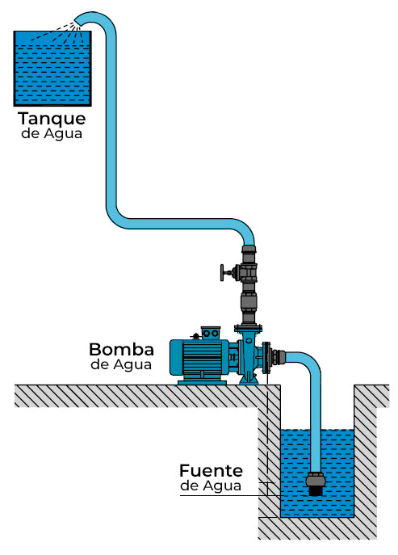{fig-cap="Recurso visual de la presentación original · diapositiva 2"}

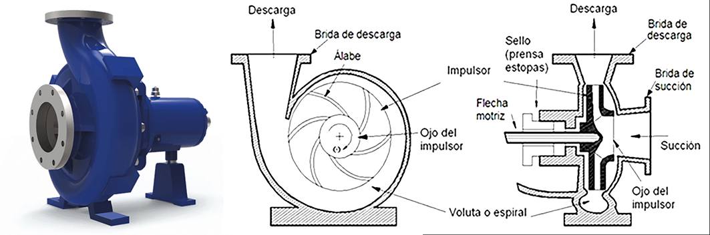{fig-cap="Recurso visual de la presentación original · diapositiva 2"}

## 2. Turbinas de vapor

Las turbinas de vapor son máquinas rotativas que convierten la energía térmica del vapor en energía mecánica. Este proceso se utiliza para accionar generadores eléctricos, propulsar barcos y aviones, y para otras aplicaciones industriales. La expansión del vapor a alta presión a través de una serie de palas dentro de la turbina genera movimiento rotacional.

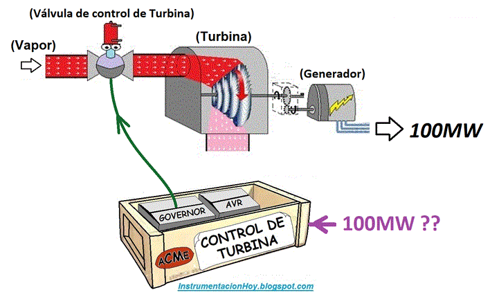{fig-cap="Recurso visual de la presentación original · diapositiva 3"}

## 3. Trabajo en bombas y turbinas

Transferencia de trabajo (W)

Una interacción de energía que no es causada por una diferencia de temperatura entre un sistema y el exterior es trabajo. La transferencia de trabajo a un sistema (es decir, el trabajo realizado sobre un sistema) incrementa la energía de éste, mientras que la transferencia de trabajo desde un sistema (es decir, el trabajo realizado por el sistema) la disminuye, puesto que la energía transferida como trabajo viene de la energía contenida en el sistema. Los motores de automóviles y las turbinas hidráulicas, de vapor o de gas, producen trabajo mientras que los compresores, las bombas y los mezcladores consumen trabajo.

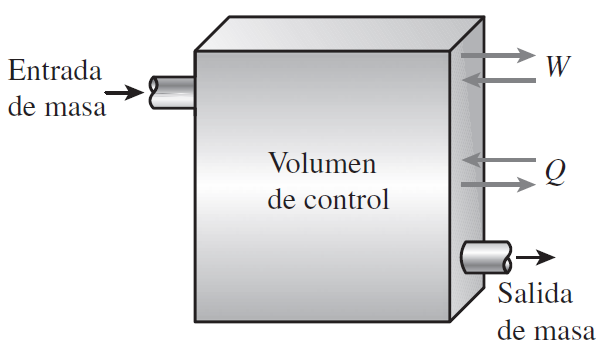{fig-cap="Recurso visual de la presentación original · diapositiva 4"}

## 4. Eficiencia isentrópica

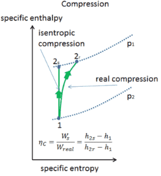{fig-cap="Recurso visual de la presentación original · diapositiva 5"}

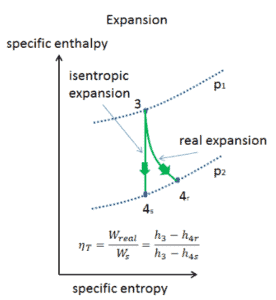{fig-cap="Recurso visual de la presentación original · diapositiva 5"}

## 5. Ejercicios de aplicación

1) Agua entra a una bomba a 30 ºC, 100 kPa y sale a 1 MPa.

a) Determine el trabajo ideal asumiendo un proceso isentrópico

b) Si se considera una eficiencia isentrópica del 80% y un flujo másico de 2 kg/s, determine la potencia consumida por la bomba.

2) Se tiene una bomba en la que ingresan idealmente 2 kJ/kg de energía mecánica, si el agua ingresa como líquido saturado a una presión de 100 kPa, determine:

a) La entalpía a la salida de la bomba en el proceso isentrópico

b) La presión a la salida de la bomba en el proceso isentrópico

b) Si el caudal de agua es de 1 l/s y se considera una eficiencia isentrópica en la bomba del 85%, determine la potencia consumida por la bomba.

## 6. Ejercicios de aplicación

3) Entra agua líquida a una bomba de 25 kW a una presión de 100 kPa, a razón de 5 kg/s. Determine la presión máxima que puede tener el agua líquida a la salida de la bomba. Desprecie los cambios de energía cinética y potencial del agua, y tome el volumen específico del agua como 0.001 m3/kg. Respuesta: 5 100 kPa

4) Entra agua líquida a 125 kPa subenfriada en 50 ºC a una bomba de 7 kW que eleva su presión a 5 MPa. Determine el flujo másico más alto de agua líquida que puede manejar esta bomba. Desprecie el cambio de energía cinética del agua y tome el volumen específico como 0.001 m3 /kg.

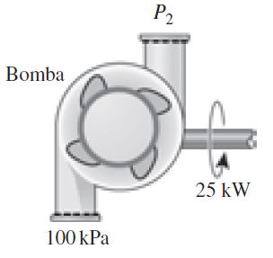{fig-cap="Recurso visual de la presentación original · diapositiva 7"}

## 7. Ejercicios de aplicación

5) Considere una turbina adiabática a la que entra vapor de agua a 10 MPa y 500 °C, y sale a 10 kPa, con 90 por ciento de calidad. Despreciando los cambios de energía cinética y potencial, determine el flujo másico necesario para producir idealmente 5 MW de potencia de salida. Respuesta: 4.852 kg/s

6) Entra vapor a una turbina de flujo uniforme con un flujo másico de 20 kg/s a 600 °C, 5 MPa, y una velocidad despreciable. El vapor se expande idealmente en la turbina hasta vapor saturado a 500 kPa, de donde 10 por ciento del vapor se extrae para algún otro uso. El resto del vapor continúa expandiéndose a la salida de la turbina, donde la presión es 10 kPa y la calidad es de 85 por ciento. Si la turbina es adiabática, determine la tasa de trabajo realizado por el vapor durante este proceso. Respuesta: 27 790 kW

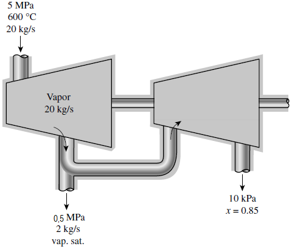{fig-cap="Recurso visual de la presentación original · diapositiva 8"}

## 8. Ejercicios de aplicación

7) En una turbina adiabática entra vapor de agua a 5 MPa y 450 °C y sale a una presión de 1.4 MPa.

a) Determine el trabajo de salida de la turbina por unidad de masa de vapor si el proceso es reversible.

b) Si se considera una eficiencia isentrópica del 90%, determine la entalpía a la salida.

8) Entra vapor de agua de forma estacionaria a una turbina adiabática a 3 Mpa y 400 °C, y sale a 50 kPa y 100 °C. Si la potencia de salida de la turbina es 2 MW, determine:

a) la eficiencia isentrópica de la turbina

b) el flujo másico del vapor que circula a través de la turbina.

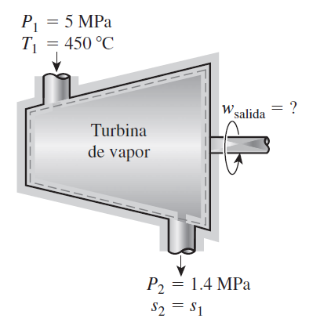{fig-cap="Recurso visual de la presentación original · diapositiva 9"}

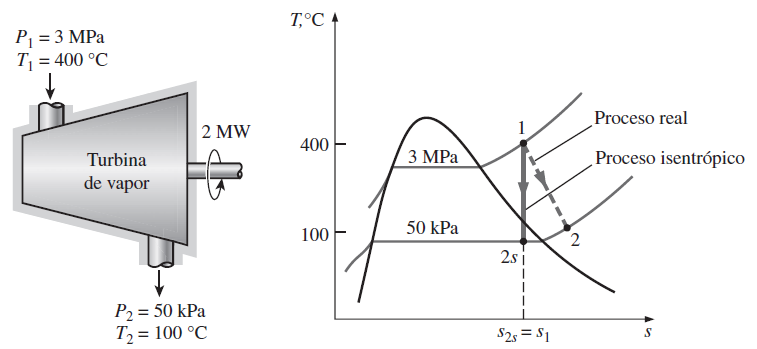{fig-cap="Recurso visual de la presentación original · diapositiva 9"}

## 9. Ejercicios de aplicación

9) Vapor de agua a 3 MPa y 400 °C se expande a 30 kPa en una turbina adiabática con eficiencia isentrópica de 92 por ciento. Determine la potencia producida por esta turbina, en kW, cuando el flujo másico es 2 kg/s.

10) Vapor a 4 MPa y 350 °C se expande en una turbina

adiabática a 120 kPa. ¿Cuál es la eficiencia isentrópica de esta

turbina si el vapor sale como vapor saturado?

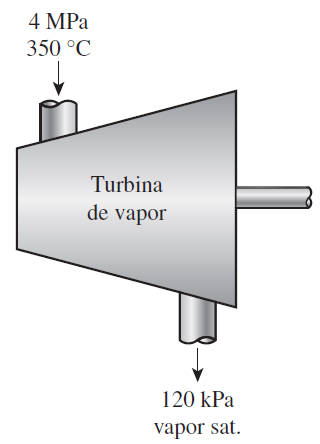{fig-cap="Recurso visual de la presentación original · diapositiva 10"}

## Recursos complementarios

- [Clase 06 Ejercicios 17 nov 2025.pdf](recursos/Clase%2006%20Ejercicios%2017%20nov%202025.pdf)

::: {.key-ideas}
## Ideas clave

- Identifique siempre el **sistema**, los **datos conocidos** y las **propiedades requeridas** antes de plantear ecuaciones.
- Utilice unidades consistentes y represente los estados o procesos mediante el diagrama termodinámico apropiado cuando corresponda.
- Relacione cada ecuación con el comportamiento físico del equipo o proceso analizado.
:::
