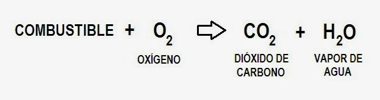
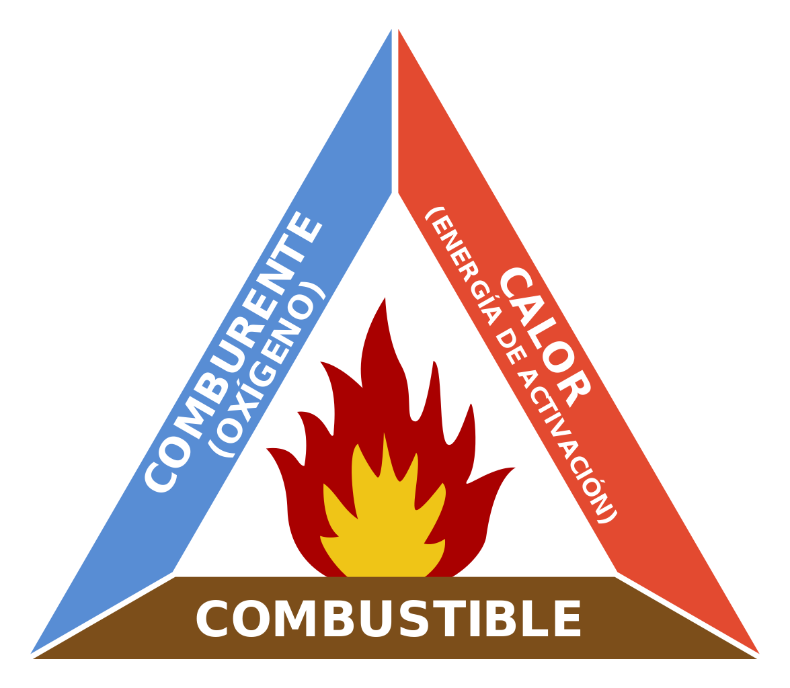
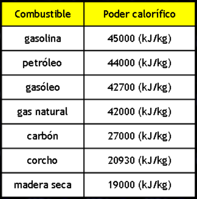
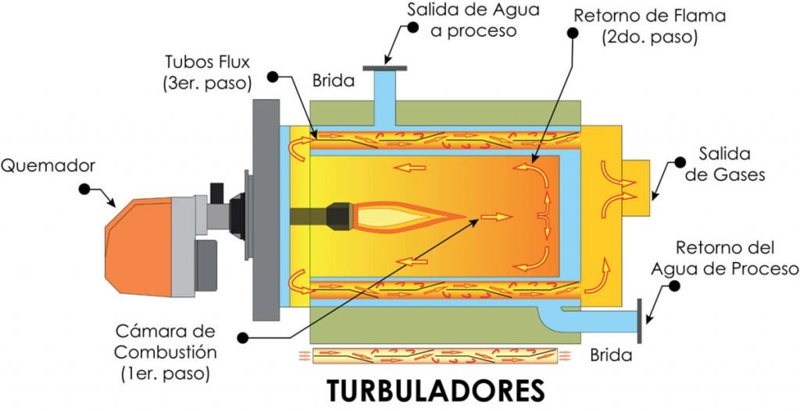
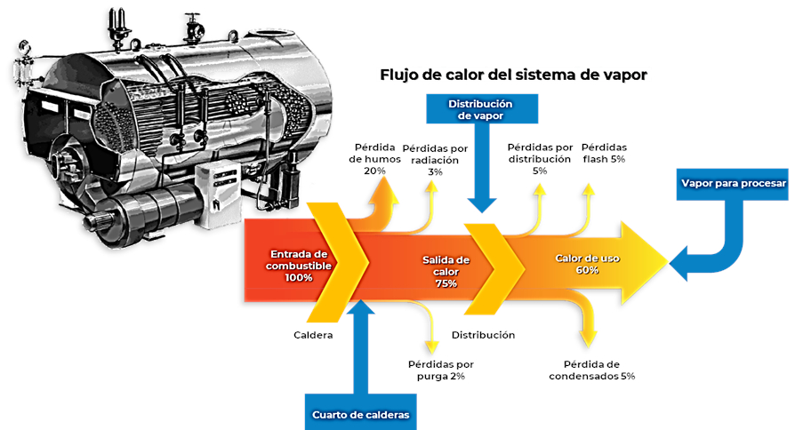
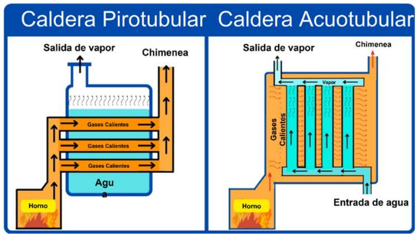

::: {.learning-outcomes}
## Resultados de aprendizaje

Al finalizar esta clase, el estudiante estará en capacidad de:

- Describir el proceso de combustión y el poder calorífico.
- Interpretar la eficiencia de combustión.
- Relacionar la combustión con el funcionamiento de calderas.
:::

## 1. Proceso de combustión

La combustión es un proceso químico donde una sustancia (combustible) reacciona rápidamente con un oxidante (generalmente oxígeno), liberando energía en forma de calor y luz, comúnmente como llama. Es un proceso exotérmico, lo que significa que libera más energía térmica de la que consume.

{fig-cap="Recurso visual de la presentación original · diapositiva 2"}

{fig-cap="Recurso visual de la presentación original · diapositiva 2"}

## 2. Poder calórico del combustible

Es la cantidad de calor que se libera al quemarse por completo una unidad de masa o volumen de dicho combustible.

{fig-cap="Recurso visual de la presentación original · diapositiva 3"}

{fig-cap="Recurso visual de la presentación original · diapositiva 3"}

## 3. Eficiencia de combustión

La eficiencia de combustión se refiere a la capacidad de un proceso de combustión para convertir eficientemente el combustible en energía térmica y minimizar las emisiones contaminantes.

{fig-cap="Recurso visual de la presentación original · diapositiva 4"}

## 4. Calderas

Una caldera, en su sentido más general, es un recipiente de metal utilizado para calentar agua o producir vapor.

{fig-cap="Recurso visual de la presentación original · diapositiva 5"}

## 5. Ejercicios de aplicación

Determinar la energía por unidad de masa que necesita el agua en una caldera que trabaja a 1 Mpa de presión, si el agua ingresa a una temperatura de 15 ºC y sale a una temperatura de 300 ºC.

En una caldera que funciona con combustible (el calor se produce como producto de la combustión), ingresa agua a una presión de 1 MPa y una temperatura de 10°C y sale como vapor sobrecalentado a 1 MPa y 280°C, si el flujo másico de agua que se evapora es de 4 kg/s y la eficiencia de la caldera es de 0,8, determine la tasa de calor que se necesita suministrar desde el combustible.

## 6. Ejercicios de aplicación

3) Se tiene una caldera que trabaja a una presión de 2 MPa en la que se produce 6 kg/s de vapor saturado. El agua ingresa a una temperatura de 20°C a presión constante de 2 MPa. Determine:

La tasa de calor necesaria que se debe suministrar.

Si la eficiencia de combustión es de 0.83, determine el flujo másico de combustible que se necesita si se utiliza Diesel con un poder calórico de 43500 kJ/kg.

4) Se tiene un calentador de agua que trabaja a una presión de 500 kPa en el que se desea producir 25 litros de agua caliente a 80°C por minuto. El agua ingresa a una temperatura de 10°C. Determine:

• La tasa de calor necesaria que se debe suministrar.

• Si es un calentador que usa combustible, y la eficiencia de combustión es de 0.70, determine la cantidad de combustible que se necesita. El calentador trabaja con Diesel (poder calórico de 43500 kJ/kg).

::: {.key-ideas}
## Ideas clave

- Identifique siempre el **sistema**, los **datos conocidos** y las **propiedades requeridas** antes de plantear ecuaciones.
- Utilice unidades consistentes y represente los estados o procesos mediante el diagrama termodinámico apropiado cuando corresponda.
- Relacione cada ecuación con el comportamiento físico del equipo o proceso analizado.
:::
