::: {.learning-outcomes}
## Resultados de aprendizaje

Al finalizar esta clase, el estudiante estará en capacidad de:

- Representar los procesos del ciclo Rankine en diagramas termodinámicos.
- Calcular trabajo, calor y eficiencia térmica del ciclo.
- Distinguir el ciclo ideal de las irreversibilidades del ciclo real.
:::

## 1. Ciclo Rankine ideal (procesos reversibles)

El ciclo utilizado para la generación eléctrica a partir de vapor de agua.

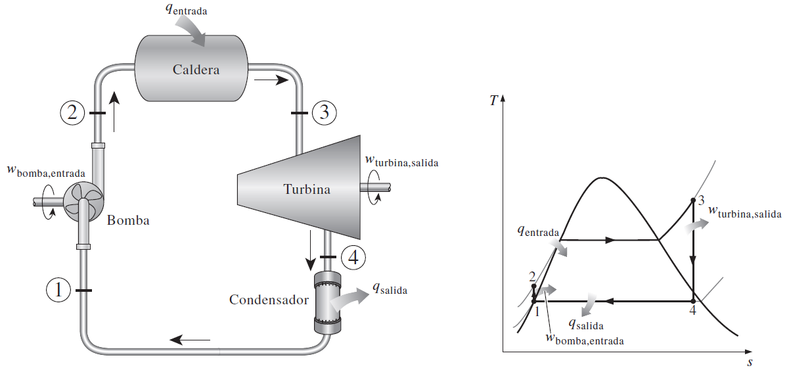{fig-cap="Recurso visual de la presentación original · diapositiva 2"}

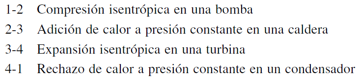{fig-cap="Recurso visual de la presentación original · diapositiva 2"}

## 2. Ciclo Rankine ideal (proceso reversible)

Los cuatro componentes asociados con el ciclo Rankine (la bomba, la caldera, la turbina y el condensador) son dispositivos de flujo estacionario.

Eficiencia del ciclo:

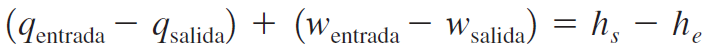{fig-cap="Recurso visual de la presentación original · diapositiva 3"}

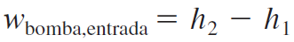{fig-cap="Recurso visual de la presentación original · diapositiva 3"}

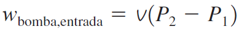{fig-cap="Recurso visual de la presentación original · diapositiva 3"}

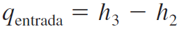{fig-cap="Recurso visual de la presentación original · diapositiva 3"}

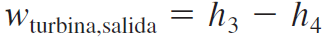{fig-cap="Recurso visual de la presentación original · diapositiva 3"}

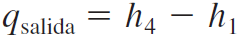{fig-cap="Recurso visual de la presentación original · diapositiva 3"}

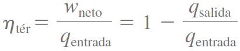{fig-cap="Recurso visual de la presentación original · diapositiva 3"}

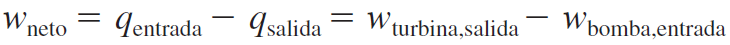{fig-cap="Recurso visual de la presentación original · diapositiva 3"}

## 3. Ejercicios de aplicación

Considere una central eléctrica de vapor que opera en el ciclo Rankine ideal simple. El vapor de agua entra a la turbina a 3 MPa y 350 °C y es condensado en el condensador a una presión de 75 kPa. Determine la eficiencia térmica de este ciclo.

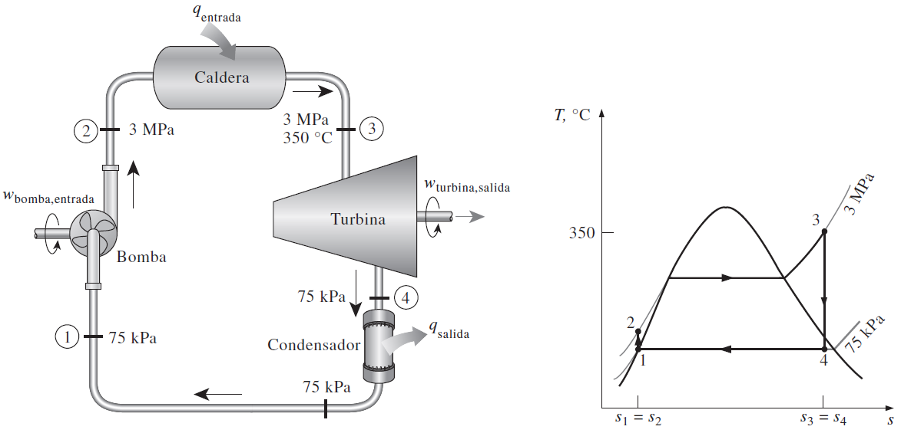{fig-cap="Recurso visual de la presentación original · diapositiva 4"}

## 4. Ejercicios de aplicación

2) Un ciclo Rankine ideal simple que usa agua como fluido de trabajo opera su condensador a 40 °C y su caldera a 300 °C. Calcule el trabajo específico que produce la turbina, el calor específico que se suministra en la caldera, y la eficiencia térmica de este ciclo cuando el vapor entra a la turbina sin ningún sobrecalentamiento.

3) La turbina de una planta eléctrica de vapor que opera en un ciclo Rankine ideal simple produce 1 750 kW de potencia cuando la caldera opera a 800 psia, el condensador a 3 psia, y la temperatura a la entrada de la turbina es 900 °F. Determine la tasa de suministro de calor en la caldera, la tasa de rechazo de calor en el condensador y la eficiencia térmica del ciclo.

Considere: 1 W corresponde a 3,41 BTU/h

## 5. Ejercicios de aplicación

4) Considere una planta eléctrica de vapor de agua que opera en un ciclo Rankine ideal simple y tiene una producción neta de potencia de 45 MW. El vapor entra a la turbina a 7 MPa y 500 °C y se enfría en el condensador a una presión de 10 kPa mediante la circulación de agua de enfriamiento de un lago por los tubos del condensador a razón de 2.000 kg/s.

Muestre el ciclo en un diagrama T-s con respecto a las líneas de saturación y determine:

a) la eficiencia térmica del ciclo,

b) el flujo másico del vapor

c) la elevación de temperatura del agua de enfriamiento.

Respuestas: a) 38.9 por ciento, b) 36 kg/s, c) 8.4 °C

## 6. Ejercicios de aplicación

5) Considere una planta termoeléctrica que quema el carbón y que produce 120 MW de potencia eléctrica. La planta opera en un ciclo Rankine ideal simple con condiciones de entrada a la turbina de 9 MPa y 550 °C, y una presión del condensador de 15 kPa. El carbón tiene un poder calorífico (energía liberada cuando se quema el combustible) de 29,300 kJ/kg. Suponiendo que 75 por ciento de esta energía se transfiere al vapor de agua en la caldera, y que el generador eléctrico tiene una eficiencia de 96 por ciento, determine:

La eficiencia total de la planta (la relación de producción neta de potencia eléctrica a entrada de energía como resultado de combustión de combustible)

la tasa necesaria de suministro de carbón.

Respuestas: a) 28.4 por ciento, b) 51.9 t/h

## 7. Ejercicios de aplicación

6) Un ciclo Rankine ideal simple opera entre los límites de presión de 10 kPa y 3 MPa, con una temperatura de entrada a la turbina de 600 °C. Despreciando el trabajo de la bomba, determine la eficiencia del ciclo.

7) Un ciclo Rankine ideal simple opera entre los límites de presión de 10 kPa y 5 MPa, con una temperatura de entrada a la turbina de 600 °C. Determine la fracción de masa del vapor de agua que se condensa a la salida de la turbina.

8) Una planta termoeléctrica de vapor de agua opera en el ciclo Rankine ideal simple, entre los límites de presión de 10 kPa y 5 MPa, con una temperatura de entrada a la turbina de 600 °C. La tasa de transferencia de calor en la caldera es 300 kJ/s. Despreciando el trabajo de la bomba, determine la producción de trabajo de esta planta.

## 8. Ciclo Rankine real (procesos irreversibles)

El ciclo real de potencia de vapor difiere del ciclo Rankine ideal, como se ilustra en la figura, como resultado de las irreversibilidades en diversos componentes. La fricción del fluido y las pérdidas de calor hacia los alrededores son las dos fuentes más comunes de irreversibilidades.

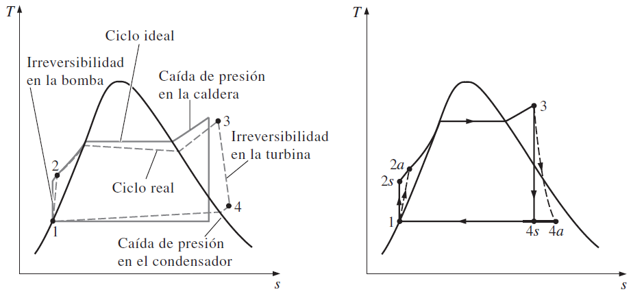{fig-cap="Recurso visual de la presentación original · diapositiva 9"}

## 9. Ejercicios de aplicación

Un ciclo Rankine simple usa agua como fluido de trabajo. La caldera opera a 6 000 kPa y el condensador a 50 kPa. A la entrada de la turbina, la temperatura es 450 °C. La eficiencia isentrópica de la turbina es 94 por ciento, las pérdidas de presión y de bomba son despreciables, y el agua que sale del condensador está subenfriada en 6.32 °C. La caldera está diseñada para un flujo másico de 20 kg/s. Determine la tasa de adición de calor en la caldera, la potencia necesaria para operar las bombas, la potencia neta producida por el ciclo, y la eficiencia térmica.

Respuestas: 59 660 kW; 122 kW; 18 050 kW; 30.3 por ciento

## 10. Ejercicios de aplicación

2) Una planta de vapor que sigue un Ciclo Rankine, opera ente las presiones de 20 MPa y 100 kPa con el fin de generar energía eléctrica para una pequeña comunidad rural que requiere una potencia de 10 MW. Para ello la municipalidad está dispuesta a invertir 30 millones de dólares por año en la operación de la planta. Los detalles técnicos de la planta de vapor son:

i) La caldera entrega vapor sobrecalentado en 35º C sobre la temperatura de saturación.

ii) La turbina y bomba tienen eficiencias isentrópicas del 80% y del 90% respectivamente.

iii) El costo de cada kilogramo de vapor producido es de 0.05 USD

iv) La planta funcionará 24 horas al día y 365 días por año.

Se desea saber si el proyecto es factible, para ello debe calcular el flujo másico de vapor requerido, y a partir de este dato se debe determinar el costo anual de funcionamiento de la planta y compararlo con la inversión que se realizará anualmente. Adicionalmente, determine el rendimiento térmico de la planta.

::: {.key-ideas}
## Ideas clave

- Identifique siempre el **sistema**, los **datos conocidos** y las **propiedades requeridas** antes de plantear ecuaciones.
- Utilice unidades consistentes y represente los estados o procesos mediante el diagrama termodinámico apropiado cuando corresponda.
- Relacione cada ecuación con el comportamiento físico del equipo o proceso analizado.
:::
