::: {.learning-outcomes}
## Resultados de aprendizaje

Al finalizar esta clase, el estudiante estará en capacidad de:

- Explicar métodos de mejoramiento de la eficiencia del ciclo Rankine.
- Analizar el efecto del recalentamiento.
- Plantear balances de masa y energía en regeneración.
:::

## 1. Mejoramiento de la eficiencia ciclo Rankine

Reducción de la presión del condensador

La reducción de la presión del condensador no deja de tener efectos colaterales. Por un lado, crea la posibilidad de las filtraciones de aire dentro del condensador; y más importante aún es el incremento del contenido de humedad del vapor en las etapas finales de la turbina, como puede verse en la figura.

La presencia de grandes cantidades de humedad es indeseable en las turbinas, porque disminuye su eficiencia y erosiona sus álabes.

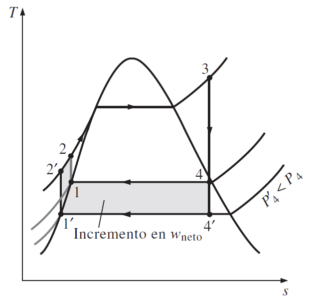{fig-cap="Recurso visual de la presentación original · diapositiva 2"}

## 2. Mejoramiento de la eficiencia ciclo Rankine

Sobrecalentamiento del vapor a altas temperaturas

La temperatura a la que el vapor se sobrecalienta está limitada debido a consideraciones metalúrgicas. En la actualidad la temperatura de vapor más alta permisible en la entrada de la turbina es de aproximadamente 620 °C.

Cualquier incremento en este valor depende del mejoramiento de los materiales actuales o del descubrimiento de otros nuevos que puedan soportar temperaturas más altas.

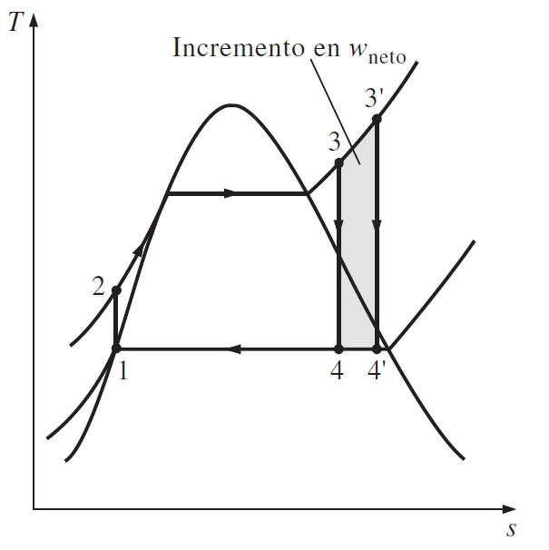{fig-cap="Recurso visual de la presentación original · diapositiva 3"}

## 3. Mejoramiento de la eficiencia ciclo Rankine

Incremento de la presión de la caldera

Las presiones de operación de las calderas se han incrementado en forma gradual a lo largo de los años, desde 2.7 MPa (400 psia) en 1922, hasta más de 30 MPa (4500 psia) en la actualidad, generando el suficiente vapor para producir una salida neta de potencia de 1000 MW o más en una central eléctrica grande de vapor. Actualmente, muchas de estas modernas centrales operan a presiones supercríticas (P > 22.06 MPa) y tienen eficiencias térmicas de 40 por ciento en el caso de centrales que funcionan con combustibles fósiles y de 34 por ciento para las nucleoeléctricas.

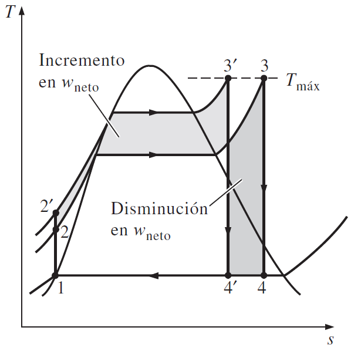{fig-cap="Recurso visual de la presentación original · diapositiva 4"}

## 4. Ejercicios de aplicación

Efecto de la presión y la temperatura de la caldera sobre la eficiencia

Considere una central eléctrica de vapor que opera con el ciclo Rankine ideal. El vapor entra a la turbina a 3 MPa y 350 °C y se condensa en el condensador a una presión de 10 kPa. Determine:

la eficiencia térmica de esta central eléctrica

la eficiencia térmica si el vapor se sobrecalienta a 600 °C en lugar de 350 °C

la eficiencia térmica si la presión de la caldera se eleva a 15 MPa mientras la temperatura de entrada de la turbina se mantiene en 600 °C.

Comente los resultados obtenidos.

## 5. Ciclo Rankine ideal con recalentamiento

El ciclo Rankine ideal con recalentamiento difiere del ciclo Rankine ideal simple en que el proceso de expansión sucede en dos etapas.

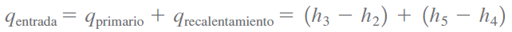{fig-cap="Recurso visual de la presentación original · diapositiva 6"}

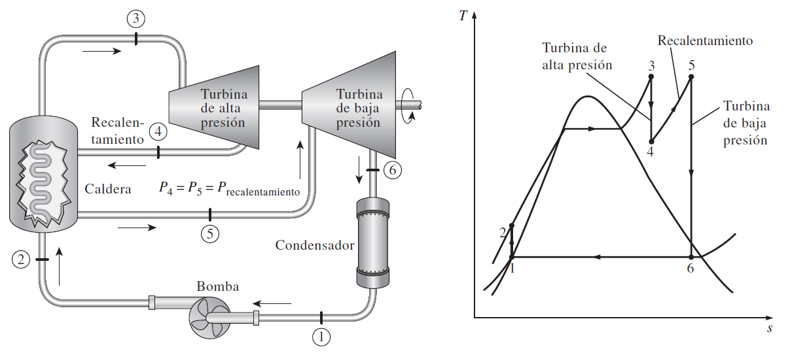{fig-cap="Recurso visual de la presentación original · diapositiva 6"}

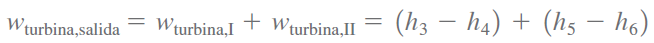{fig-cap="Recurso visual de la presentación original · diapositiva 6"}

## 6. Ciclo Rankine ideal regenerativo

Calentadores abiertos de agua de alimentación

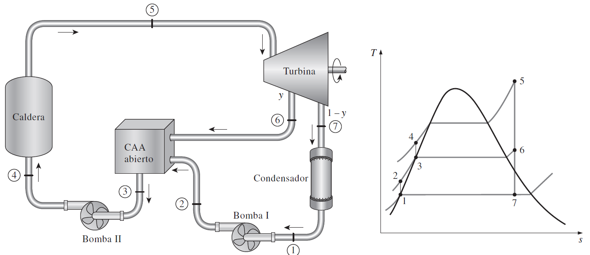{fig-cap="Recurso visual de la presentación original · diapositiva 7"}

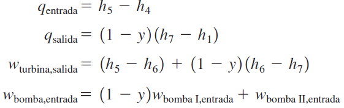{fig-cap="Recurso visual de la presentación original · diapositiva 7"}

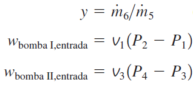{fig-cap="Recurso visual de la presentación original · diapositiva 7"}

## 7. Ciclo Rankine ideal regenerativo

Calentadores cerrados de agua de alimentación

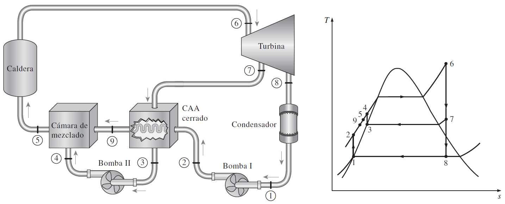{fig-cap="Recurso visual de la presentación original · diapositiva 8"}

## 8. Ejercicios de aplicación

1) Un ciclo ideal de recalentamiento Rankine con agua como fluido de trabajo opera la entrada de la turbina de alta presión a 8 000 kPa y 450 °C; la entrada de la turbina de baja presión a 500 kPa y 500 °C, y el condensador a 10 kPa. Determine el flujo másico a través de la caldera que se necesita para que este sistema produzca una potencia neta de 5 000 kW, y la eficiencia térmica del ciclo.

2) Un ciclo Rankine ideal con recalentamiento con agua como el fluido de trabajo funciona con una presión en la caldera de 15 000 kPa, el recalentador a 2 000 kPa y el condensador a 100 kPa. La temperatura es de 450 °C a la entrada de las turbinas de alta y baja presión. El flujo másico a través del ciclo es de 1.74 kg/s. Determine la potencia usada por las bombas, la potencia producida por el ciclo, la tasa de transferencia de calor en el recalentador y la eficiencia térmica de este sistema.

## 9. Ejercicios de aplicación

3) Considere una central eléctrica de vapor que opera en el ciclo Rankine ideal con recalentamiento. El vapor entra a la turbina de alta presión a 15 MPa y 600 °C y se condensa a una presión de 10 kPa. Si el contenido de humedad del vapor a la salida de la turbina de baja presión no excede 10.4 por ciento, determine: a) la presión a la que el vapor se debe recalentarse, y b) la eficiencia térmica del ciclo. Suponga que el vapor se recalienta hasta la temperatura de entrada de la turbina de alta presión.

4) Una planta termoeléctrica de vapor de agua opera en un ciclo Rankine ideal con recalentamiento entre los límites de presión de 15 MPa y 10 kPa. El flujo másico de vapor a través del ciclo es 12 kg/s. El vapor entra a ambas etapas de la turbina a 500 °C. Si el contenido de humedad del vapor a la salida de la turbina de baja presión no debe exceder 10 por ciento, determine a) la presión a la que tiene lugar el recalentamiento, b) la tasa total de entrada de calor a la caldera y c) la eficiencia térmica del ciclo. También muestre el ciclo en un diagrama T-s con respecto a las líneas de saturación.

## 10. Ejercicios de aplicación

5) Considere una planta termoeléctrica de vapor de agua que opera en el ciclo Rankine ideal con recalentamiento. La planta mantiene la caldera a 7.000 kPa, la sección de recalentamiento a 800 kPa, y el condensador a 10 kPa. La calidad del vapor húmedo a la salida de ambas turbinas es de 93 por ciento. Determine la temperatura a la entrada de cada turbina y la eficiencia térmica del ciclo.

6) Considere una central eléctrica de vapor que opera en un ciclo Rankine ideal regenerativo con un calentador abierto de agua de alimentación. El vapor entra a la turbina a 15 MPa y 600 °C, y se condensa en el condensador a una presión de 10 kPa. Una parte de vapor sale de la turbina a una presión de 1.2 MPa y entra al calentador abierto de agua de alimentación. Determine la fracción de vapor extraído de la turbina y la eficiencia térmica del ciclo.

## 11. Ejercicios de aplicación

7) Una planta termoeléctrica de vapor opera en un ciclo Rankine regenerativo ideal. El vapor entra a la turbina a 6 MPa y 450 °C y se condensa en el condensador a 20 kPa. Se extrae de la turbina vapor a 0.4 MPa para calentar el agua de alimentación en un calentador de agua de alimentación abierto. El agua sale del calentador de agua de alimentación como líquido saturado.

Muestre el ciclo en un diagrama T-s y determine:

el trabajo neto realizado por kilogramo de vapor que fluye por la caldera

la eficiencia térmica del ciclo.

Respuestas: a) 1 017 kJ/kg, b) 37.8 por ciento

## 12. Ejercicios de aplicación

8) Considere un ciclo Rankine regenerativo ideal de vapor con dos calentadores de agua de alimentación, uno cerrado y uno abierto. El vapor entra a la turbina a 10 MPa and 600 °C y escapa hacia el condensador a 10 kPa. Se extrae vapor de la turbina a 1.2 MPa para el calentador de agua de alimentación cerrado y a 0.6 MPa para el abierto. El agua de alimentación se calienta a la temperatura de condensación del vapor extraído en el calentador de agua de alimentación cerrado. El vapor extraído sale del calentador cerrado como líquido saturado, que posteriormente se estrangula hacia el calentador abierto. Muestre el ciclo en un diagrama T-s con respecto a las líneas de saturación y determine:

a) la tasa de flujo másico del vapor a través de la caldera para una producción neta de potencia de 400 MW

b) la eficiencia térmica del ciclo.

## 13. Ejercicios de aplicación

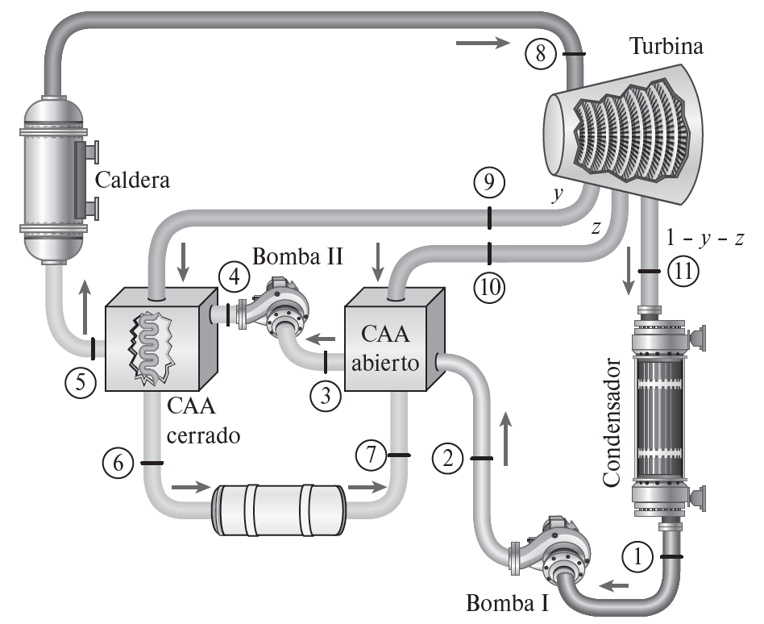{fig-cap="Recurso visual de la presentación original · diapositiva 14"}

## 14. Ejercicios de aplicación

9) Considere una central eléctrica de vapor que opera en un ciclo Rankine ideal regenerativo con recalentamiento, con dos calentadores de agua de alimentación, uno abierto y otro cerrado, además de un recalentador. El vapor entra a la turbina a 15 MPa y 600 °C y se condensa a una presión de 10 kPa. Una parte de vapor se extrae de la turbina a 4 MPa para el calentador cerrado, mientras que el resto se recalienta a la misma presión hasta 600 °C. El vapor extraído se condensa por completo en el calentador y se bombea hasta 15 MPa antes de mezclarse con el agua de alimentación a la misma presión. El vapor para el calentador abierto se extrae de la turbina de baja presión a una presión de 0.5 MPa. Determine las fracciones de vapor extraído de la turbina, así como la eficiencia térmica del ciclo.

## 15. Ejercicios de aplicación

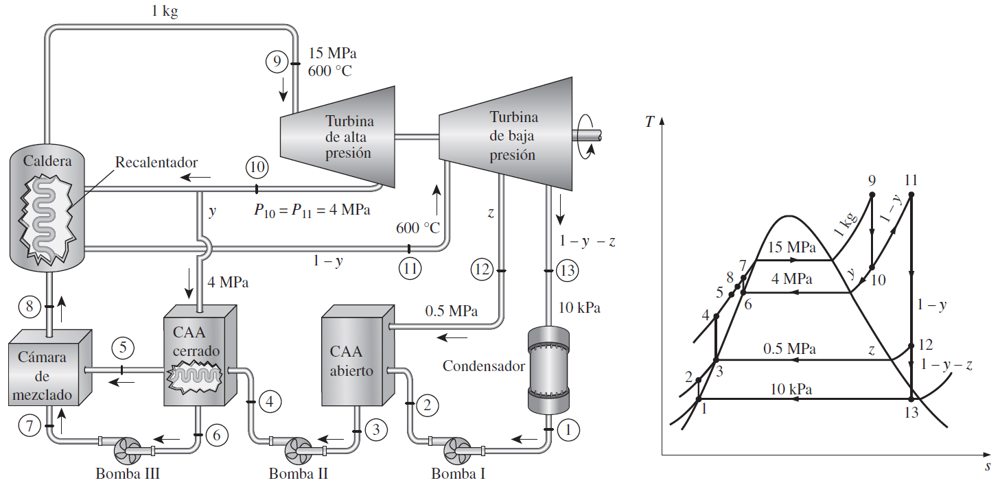{fig-cap="Recurso visual de la presentación original · diapositiva 16"}

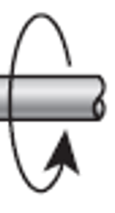{fig-cap="Recurso visual de la presentación original · diapositiva 16"}

::: {.key-ideas}
## Ideas clave

- Identifique siempre el **sistema**, los **datos conocidos** y las **propiedades requeridas** antes de plantear ecuaciones.
- Utilice unidades consistentes y represente los estados o procesos mediante el diagrama termodinámico apropiado cuando corresponda.
- Relacione cada ecuación con el comportamiento físico del equipo o proceso analizado.
:::
