::: {.learning-outcomes}
## Resultados de aprendizaje

Al finalizar esta clase, el estudiante estará en capacidad de:

- Reconocer los componentes básicos de motores reciprocantes.
- Representar y analizar los ciclos Otto y Diesel.
- Calcular parámetros de desempeño con suposiciones de aire estándar.
:::

## 1. Motores de combustión interna / Ciclo Otto / Diesel

Ciclo de potencia de gas Idealizaciones → procesos isentrópicos

Suposiciones de aire estándar

Relación aire-combustible: 14.7:1 en masa / 94% aire en volumen

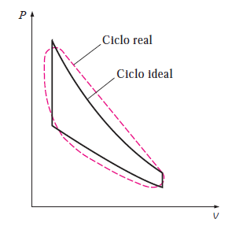{fig-cap="Recurso visual de la presentación original · diapositiva 2"}

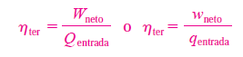{fig-cap="Recurso visual de la presentación original · diapositiva 2"}

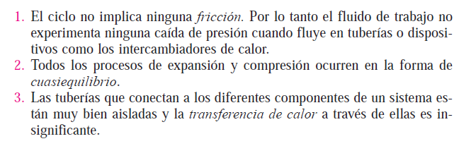{fig-cap="Recurso visual de la presentación original · diapositiva 2"}

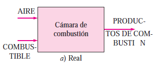{fig-cap="Recurso visual de la presentación original · diapositiva 2"}

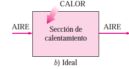{fig-cap="Recurso visual de la presentación original · diapositiva 2"}

## 2. Motores de combustión interna / Ciclo Otto / Diesel

Máquinas reciprocantes

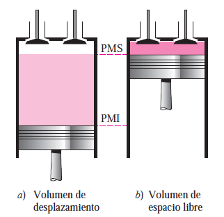{fig-cap="Recurso visual de la presentación original · diapositiva 3"}

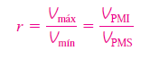{fig-cap="Recurso visual de la presentación original · diapositiva 3"}

{fig-cap="Recurso visual de la presentación original · diapositiva 3"}

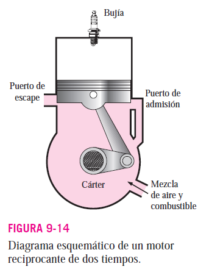{fig-cap="Recurso visual de la presentación original · diapositiva 3"}

## 3. Motores de combustión interna / Ciclo Otto

Ciclo otto

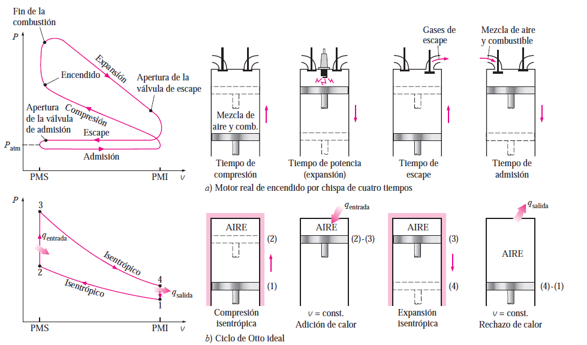{fig-cap="Recurso visual de la presentación original · diapositiva 4"}

## 4. Motores de combustión interna / Ciclo Otto

Ciclo otto

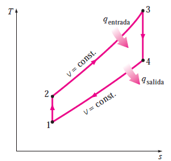{fig-cap="Recurso visual de la presentación original · diapositiva 5"}

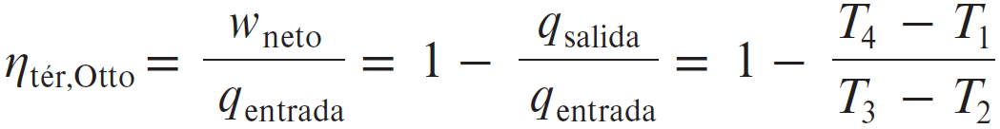{fig-cap="Recurso visual de la presentación original · diapositiva 5"}

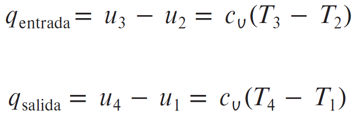{fig-cap="Recurso visual de la presentación original · diapositiva 5"}

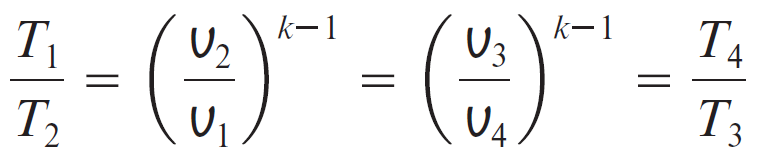{fig-cap="Recurso visual de la presentación original · diapositiva 5"}

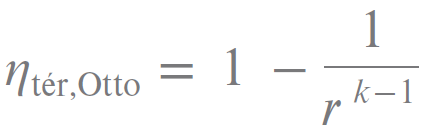{fig-cap="Recurso visual de la presentación original · diapositiva 5"}

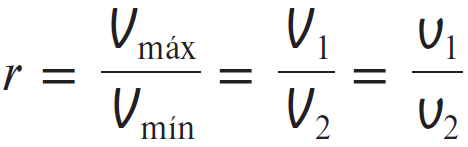{fig-cap="Recurso visual de la presentación original · diapositiva 5"}

## 5. Motores de combustión interna / Ciclo Otto

Ciclo otto

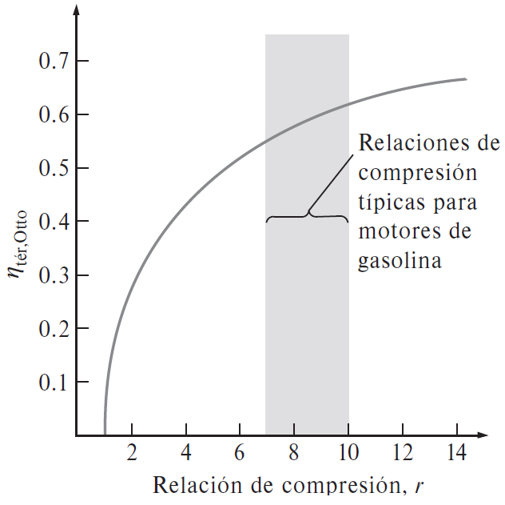{fig-cap="Recurso visual de la presentación original · diapositiva 6"}

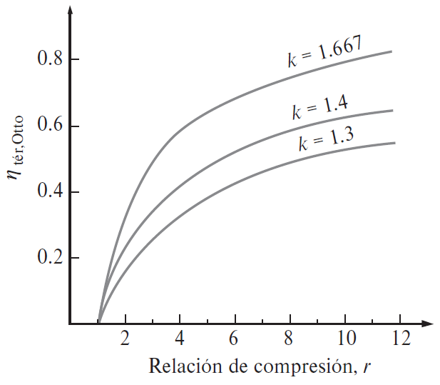{fig-cap="Recurso visual de la presentación original · diapositiva 6"}

## 6. Motores de combustión interna / Ciclo Otto / Diesel

Ciclo Diesel

Relación de corte de admisión:

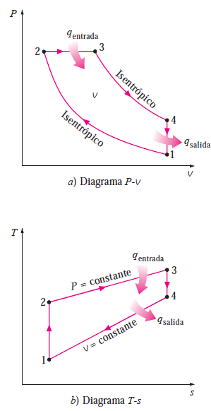{fig-cap="Recurso visual de la presentación original · diapositiva 7"}

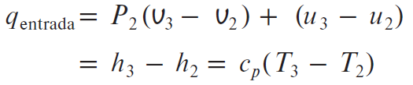{fig-cap="Recurso visual de la presentación original · diapositiva 7"}

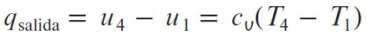{fig-cap="Recurso visual de la presentación original · diapositiva 7"}

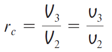{fig-cap="Recurso visual de la presentación original · diapositiva 7"}

{fig-cap="Recurso visual de la presentación original · diapositiva 7"}

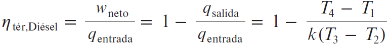{fig-cap="Recurso visual de la presentación original · diapositiva 7"}

## 7. Motores de combustión interna / Ciclo Otto / Diesel

Ciclo diesel

Los motores diésel operan con relaciones de compresión mucho más altas, por lo que suelen ser más eficientes que los de encendido por chispa (gasolina). Los motores diésel también queman el combustible de manera más completa, ya que usualmente operan a menores revoluciones por minuto y la relación de masa de aire y combustible es mucho mayor que en los motores de encendido por chispa.

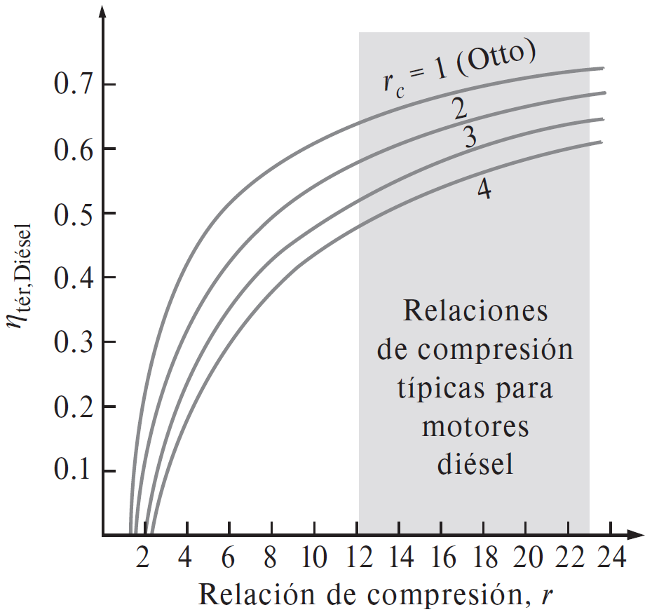{fig-cap="Recurso visual de la presentación original · diapositiva 8"}

## 8. Motores de combustión interna / Ciclo Otto / Diesel

Métodos de análisis con aire

Aproximado: Calores específicos constantes

(Uso Tabla A2)

Semiaproximado: Calores específicos variables a temperaturas variables asumiendo aire como gas ideal (Uso Tabla A-17).

Para ambos métodos:

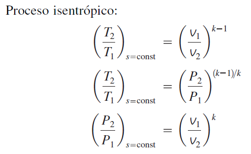{fig-cap="Recurso visual de la presentación original · diapositiva 9"}

{fig-cap="Recurso visual de la presentación original · diapositiva 9"}

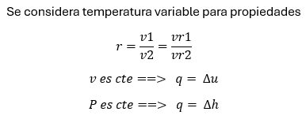{fig-cap="Recurso visual de la presentación original · diapositiva 9"}

{fig-cap="Recurso visual de la presentación original · diapositiva 9"}

## 9. Motores de combustión interna / Ciclo Otto / Diesel

1) CICLO OTTO CON CALORES ESPECÍFICOS VARIABLES. Un ciclo de Otto ideal tiene una relación de compresión de 8. Al inicio del proceso de compresión el aire está a 100 kPa y 17°C, y 800 kJ/kg de calor se transfieren a volumen constante hacia el aire durante el proceso de adición de calor. Tome en cuenta la variación de los calores específicos del aire con la temperatura y determine a) la temperatura y presión máximas que ocurren durante el ciclo, b) la salida de trabajo neto, c) la eficiencia térmica y d) la presión media efectiva en el ciclo.

2) Resuelva el ciclo Otto con el método de calores específicos constantes a una temperatura de 800 K. Compare ambos métodos y realice un comentario sobre cuál de ambos métodos considera más aproximado al ciclo real.

## 10. Motores de combustión interna / Ciclo Otto / Diesel

3) MOTOR DIESEL CON CALORES ESPECÍFICOS COSTANTES. Un motor de ignición por compresión opera en un ciclo ideal Diesel con una relación de compresión de 20. El aire está a 95 kPa y 20°C al inicio del proceso de compresión. Si la temperatura máxima en el ciclo no ha de exceder 2200k, determine a) la eficiencia térmica y b) la presión media efectiva. Considere los calores específicos constantes a 300 K.

4) MOTOR DIESEL CON CALORES ESPECÍFICOS VARIABLES. Un motor de ignición por compresión opera en un ciclo ideal Diesel con una relación de compresión de 17. El aire está a 95 kPa y 57°C al inicio del proceso de compresión. Usar calores específicos variables, la relación de cierre de admisión es de 2.5, determine a) la temperatura máxima en el ciclo b) la producción neta de trabajo por ciclo por unidad de masa y la eficiencia térmica.

## 11. Motores de combustión interna / Ciclo Otto / Diesel

5) Un motor de ignición por compresión de seis cilindros, cuatro tiempos, 4.5 L, opera en un ciclo ideal Diesel con una relación de compresión de 17 y relación de cierre de admisión de 2,5. El aire está a 95 kPa y 57°C al inicio del proceso de compresión y la velocidad de rotación del motor es de 2,000 rpm. El motor usa Diesel ligero con un poder calorífico de 42,500 kJ/kg, una relación aire-combustible de 24 y una eficiencia de combustión de 98 por ciento. Usando calores específicos variables, determine:

la temperatura máxima en el ciclo y la relación de cierre de admisión

la producción neta de trabajo por ciclo y la eficiencia térmica

la presión media efectiva

la producción neta de potencia

el consumo específico de combustible, en g/kWh, definido como la relación de la masa de combustible consumido al trabajo neto producido.

::: {.key-ideas}
## Ideas clave

- Identifique siempre el **sistema**, los **datos conocidos** y las **propiedades requeridas** antes de plantear ecuaciones.
- Utilice unidades consistentes y represente los estados o procesos mediante el diagrama termodinámico apropiado cuando corresponda.
- Relacione cada ecuación con el comportamiento físico del equipo o proceso analizado.
:::
