::: {.learning-outcomes}
## Resultados de aprendizaje

Al finalizar esta clase, el estudiante estará en capacidad de:

- Describir el ciclo Brayton ideal y sus procesos.
- Relacionar la relación de presiones con el desempeño térmico.
- Aplicar balances de energía en compresor y turbina de gas.
:::

## 1. CICLO BRAYTON: TURBINA DE GAS

Turbina gas ciclo abierto Turbina gas ciclo cerrado

Se puede modelar ciclo cerrado empleando

las suposiciones de aire estándar.

1-2 Compresión isentrópica (en un compresor)

2-3 Adición de calor a presión constante

3-4 Expansión isentrópica (en una turbina)

4-1 Rechazo de calor a presión constante

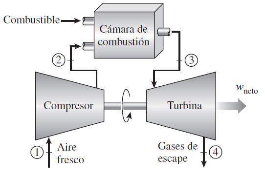{fig-cap="Recurso visual de la presentación original · diapositiva 2"}

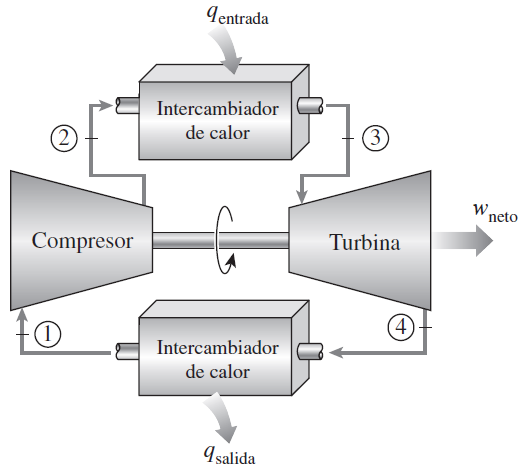{fig-cap="Recurso visual de la presentación original · diapositiva 2"}

## 2. CICLO BRAYTON: TURBINA DE GAS

Bajo las suposiciones de aire estándar frío la eficiencia térmica de un ciclo Brayton ideal depende de la relación de presión de la turbina de gas y de la relación de calores específicos del fluido de trabajo.

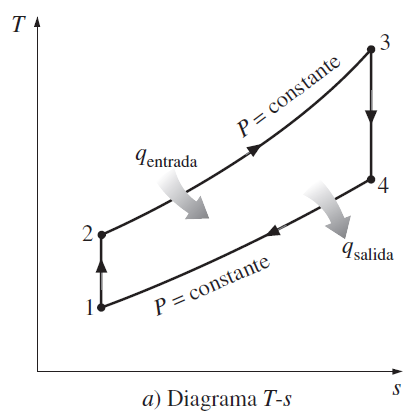{fig-cap="Recurso visual de la presentación original · diapositiva 3"}

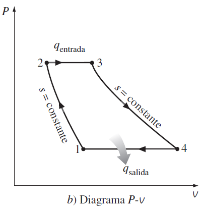{fig-cap="Recurso visual de la presentación original · diapositiva 3"}

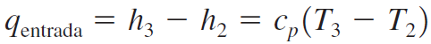{fig-cap="Recurso visual de la presentación original · diapositiva 3"}

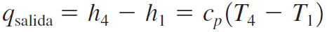{fig-cap="Recurso visual de la presentación original · diapositiva 3"}

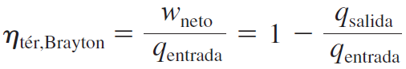{fig-cap="Recurso visual de la presentación original · diapositiva 3"}

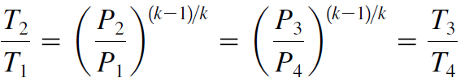{fig-cap="Recurso visual de la presentación original · diapositiva 3"}

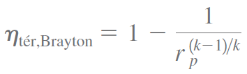{fig-cap="Recurso visual de la presentación original · diapositiva 3"}

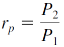{fig-cap="Recurso visual de la presentación original · diapositiva 3"}

## 3. CICLO BRAYTON: TURBINA DE GAS

1) Una central eléctrica de turbina de gas que opera en un ciclo Brayton ideal tiene una relación de presión de 8. La temperatura del gas es de 300 K en la entrada del compresor y de 1 300 K en la entrada de la turbina. Utilice las suposiciones de aire estándar y calores específicos variables. Determine: a) la temperatura del gas a la salida del compresor y de la turbina, b) la relación del trabajo de retroceso y c) la eficiencia térmica.

2) Considere un ciclo Brayton simple que usa aire como fluido de trabajo, tiene una relación de presiones de 12, una temperatura máxima de ciclo de 600 °C, y la entrada al compresor opera a 90 kPa y 15 °C. Determine la eficiencia térmica del ciclo y la relación de trabajo de retroceso.

## 4. CICLO BRAYTON: TURBINA DE GAS

3) Se usa aire como fluido de trabajo en un ciclo Brayton ideal simple que tiene una relación de presiones de 12, una temperatura de entrada al compresor de 300 K y una temperatura de entrada a la turbina de 1.000 K. Determine el flujo másico de aire necesario para una producción neta de potencia de 70 MW, suponiendo que tanto el compresor como la turbina tienen una eficiencia isentrópica de a) 100 por ciento, y b) 85 por ciento. Suponga calores específicos constantes a temperatura ambiente. Respuestas: a) 352 kg/s, b) 1.037 kg/s.

4) Un motor de avión opera en un ciclo Brayton ideal simple con una relación de presiones de 10. Se agrega calor al ciclo a razón de 500 kW; el aire pasa a través del motor a razón de 1 kg/s, y el aire al principio de la compresión está a 70 kPa y 0 °C. Determine la potencia producida por este motor y su eficiencia térmica. Use calores específicos constantes a temperatura ambiente.

## 5. CICLO BRAYTON: TURBINA DE GAS

5) Una planta eléctrica de turbina de gas opera en un ciclo Brayton simple entre los límites de presión de 100 y 2 000 kPa. El fluido de trabajo es aire, que entra al compresor a 40 °C y una razón de 700 m3/min y sale de la turbina a 650 °C. Usando calores específicos variables para el aire y suponiendo una eficiencia isentrópica de compresión de 85 por ciento y una eficiencia isentrópica de turbina de 88 por ciento, determine a) la producción neta de potencia, b) la relación del trabajo de retroceso y c) la eficiencia térmica.

Respuestas: a) 5 404 kW, b) 0.545, c) 39.2 por ciento.

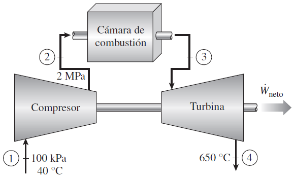{fig-cap="Recurso visual de la presentación original · diapositiva 6"}

## 6. CICLO BRAYTON: TURBINA DE GAS

6) Una planta eléctrica con turbina de gas opera en el ciclo Brayton simple entre los límites de presión de 100 y 800 kPa. El aire entra al compresor a 30 °C y sale a 330 °C a un flujo másico de 200 kg/s. La temperatura máxima del ciclo es 1 400 K. Durante la operación del ciclo, la producción neta de potencia se mide experimentalmente como 60 MW. Suponga propiedades constantes para el aire a 300 K. Determine la eficiencia isentrópica de la turbina para estas condiciones de operación, y la eficiencia térmica del ciclo.

7) Una planta eléctrica con turbina de gas que opera en el ciclo Brayton simple tiene una relación de presiones de 7. El aire entra al compresor a 0 °C y 100 kPa. La temperatura máxima del ciclo es 1 500 K. El compresor tiene una eficiencia isentrópica de 80 por ciento, y la turbina una de 90 por ciento. Suponga propiedades constantes para el aire a 300 K. Si la salida neta de potencia es 150 MW, determine el flujo volumétrico del aire hacia el compresor, en m3/s.

::: {.key-ideas}
## Ideas clave

- Identifique siempre el **sistema**, los **datos conocidos** y las **propiedades requeridas** antes de plantear ecuaciones.
- Utilice unidades consistentes y represente los estados o procesos mediante el diagrama termodinámico apropiado cuando corresponda.
- Relacione cada ecuación con el comportamiento físico del equipo o proceso analizado.
:::
