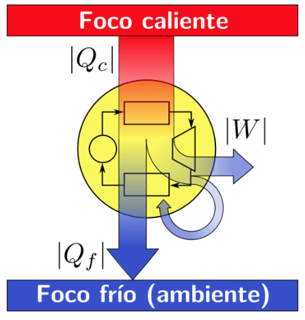

## Bienvenidos a la asignatura de Máquinas Térmicas

Durante el curso se estudiarán los fundamentos de la termodinámica aplicada y el funcionamiento de máquinas y ciclos térmicos, mediante el análisis de propiedades de sustancias puras, balances de energía, intercambiadores de calor, bombas, turbinas, calderas y ciclos de potencia.

Las clases se complementarán con ejercicios de aplicación orientados a la identificación de estados termodinámicos, el uso de tablas de propiedades, la representación de procesos en diagramas y la evaluación del desempeño energético de equipos y ciclos.

Este recurso servirá como apoyo para revisar conceptos, ecuaciones, diagramas, ejemplos, ejercicios y actividades de cada clase, con el objetivo de fortalecer la capacidad de analizar y resolver problemas propios de las máquinas térmicas.

{width="60%" fig-align="center"}
